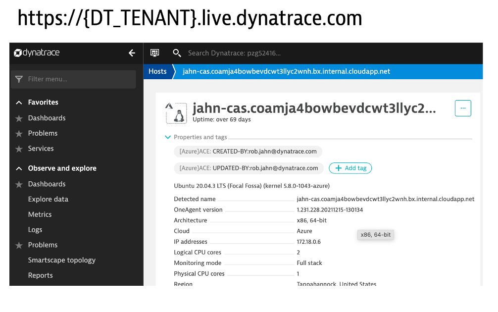

# Provision Virtual Machine with the OneAgent

Follow these steps to provision a Ubuntu Virtual Machine (VM) with the Dynatrace OneAgent and the required Unix programs to run the sample application.  

## Step 1: Provision Virtual Machine

The virtual machine will require the following:
* Ubuntu LTS 20.04
* 16GB memory
* port 22 and 80 is open
* programs:
    * docker
    * docker-compose
    * git
    * jq

You can use a VM of your choice, but below are instructions for provisioning a VM on `AWS` or `AZURE`

### AWS

1. Provision EC2 instance with AMI of `AWS Linux 2 AMI` with the following:

    * instance type of `t3.xlarge`
    * public IP
    * inbound ports 22 and 80 are open
    * 20 GB storage 

1. SSH into the host and run the following commands to install the required software

    ```
    # general utilities
    sudo yum update -y
    sudo yum install git -y
    sudo yum install jq -y

    # install docker
    # Reference: https://docs.aws.amazon.com/AmazonECS/latest/developerguide/docker-basics.html
    sudo yum update -y
    sudo yum install -y amazon-linux-extras
    sudo amazon-linux-extras install docker -y
    sudo service docker start
    sudo systemctl enable docker
    sudo usermod -a -G docker ec2-user

    # install docker-compose
    sudo curl -L "https://github.com/docker/compose/releases/download/1.28.2/docker-compose-$(uname -s)-$(uname -m)" -o /usr/bin/docker-compose
    sudo chmod +x /usr/bin/docker-compose

    # review installation
    docker version
    docker-compose version
    sudo systemctl status docker
    ```

### Azure

1. Optional but recommended to make a new resource group with name such as `dynatrace-cas`

1. Provision Virtual Machine with Image `Linux (ubuntu 20.04) - Gen2` with the following:

    * instance type of `Standard_E2_v3`
    * public IP
    * inbound ports 22 and 80 are open
    * SSD local storage

1. SSH into the host and run the following commands to install the required software.

    ```
    # general utilities
    sudo apt-get update
    sudo apt-get install -y jq

    # install docker and docker-compose
    # Reference: https://docs.docker.com/engine/install/ubuntu/
    sudo apt-get update
    sudo apt-get install -y ca-certificates curl gnupg lsb-release
    curl -fsSL https://download.docker.com/linux/ubuntu/gpg | sudo gpg --dearmor -o /usr/share/keyrings/docker-archive-keyring.gpg
    echo \
        "deb [arch=$(dpkg --print-architecture) signed-by=/usr/share/keyrings/docker-archive-keyring.gpg] https://download.docker.com/linux/ubuntu \
        $(lsb_release -cs) stable" | sudo tee /etc/apt/sources.list.d/docker.list > /dev/null

    sudo apt-get update
    sudo apt-get install -y docker-ce docker-ce-cli containerd.io
    sudo apt install -y docker-compose

    # review installation
    docker version
    docker-compose version
    sudo systemctl status docker
    ```

## Step 2: Install Dynatrace OneAgent

To install the [Dynatrace OneAgent](https://www.dynatrace.com/support/help/setup-and-configuration/dynatrace-oneagent) on the host, the easiest was for this is to:

1. Login into Dynatrace
1. Navigate to `Deploy Dynatrace` menu on the bottom left side
1. Pick `Start Installation` and then the `Linux` option
1. One the `Download Dynatrace OneAgent for Linux` page, choose `Create token` button
1. Copy and paste the `Download the installer` and `Run the installer` commands from a SSH shell for the virtual machine

## Step 3: Verify Dynatrace monitoring of sample application

In Dynatrace, navigate to `Hosts` menu on the bottom left side to review the host list. You should see your host. It should look like this:



<hr>

[](01-QUICKSTART.md) [](03-DTCONFIG.md)