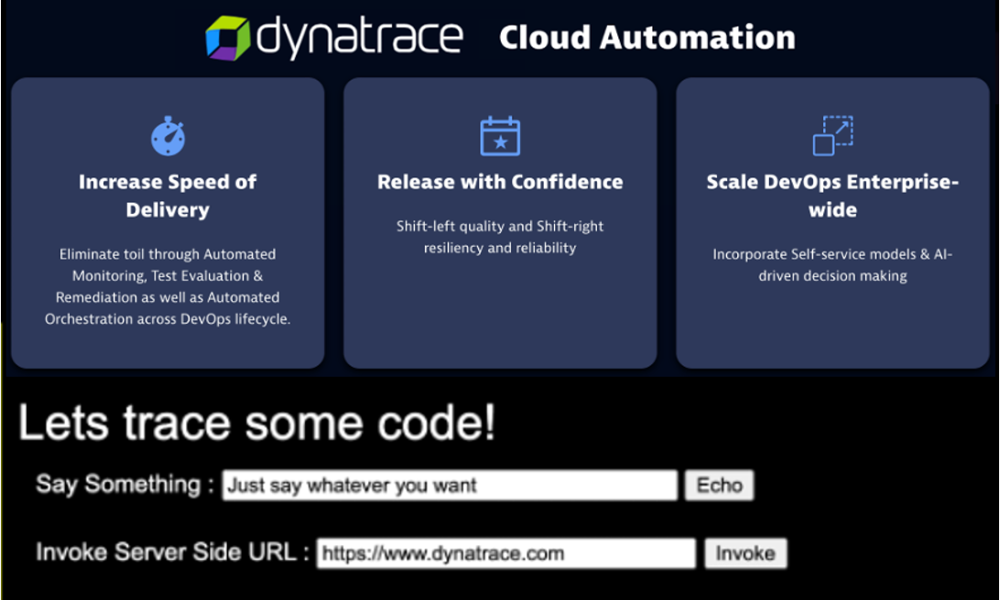

# Start the sample application

Follow these steps to start the sample application and view it in a browser

## Step 1: Start up the sample application with Docker.

1. In the SSH terminal, change to the scripts directory and start up the application

    ```
    cd ~/cloud-automation-quickstart/demoapp
    sudo docker-compose up -d
    ```

1. Verify it us running with this command `sudo docker ps` . The output should look something like:

    ```
    CONTAINER ID   IMAGE                          COMMAND                  CREATED          STATUS          PORTS                                   NAMES
    a873ae0e8d4b   dtdemos/casdemoappload:1.0.0   "sh -c '/load.sh ${H…"   11 seconds ago   Up 10 seconds                                           scripts_sendload_1
    3c2188c8b726   dtdemos/casdemoapp:1.0.0       "docker-entrypoint.s…"   11 seconds ago   Up 10 seconds   0.0.0.0:80->8080/tcp, :::80->8080/tcp   scripts_demoapp_1
    ```

## Step 2: View application in a browser

Using the public IP for the virtual machine, open the application with `http://[public-ip]`.  It should look like this:



# Stop the application

```
cd ~/cloud-automation-quickstart/demoapp
sudo docker-compose down
```

# Other useful commands

The following commands are just reference

* View logs of sample app or the load app `sudo docker logs [CONTAINER ID]`  (Get [CONTAINER ID] from the `sudo docker ps` command)
* Follow logs of sample app `sudo docker logs [CONTAINER ID] -f`  (Use ctrl-c to exit)


<hr>

[](03-DTCONFIG.md) [](05-ONBOARD.md)