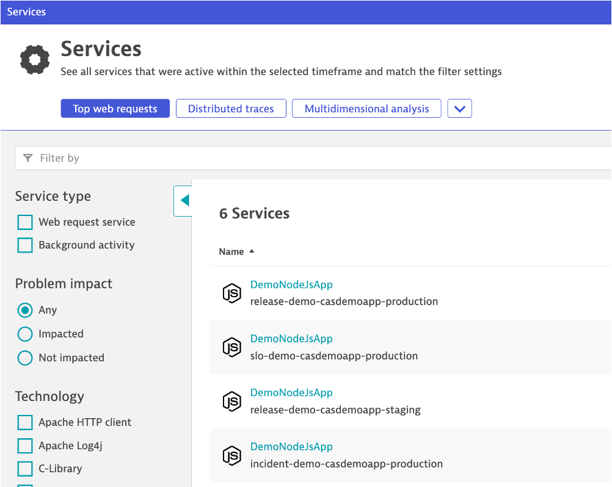
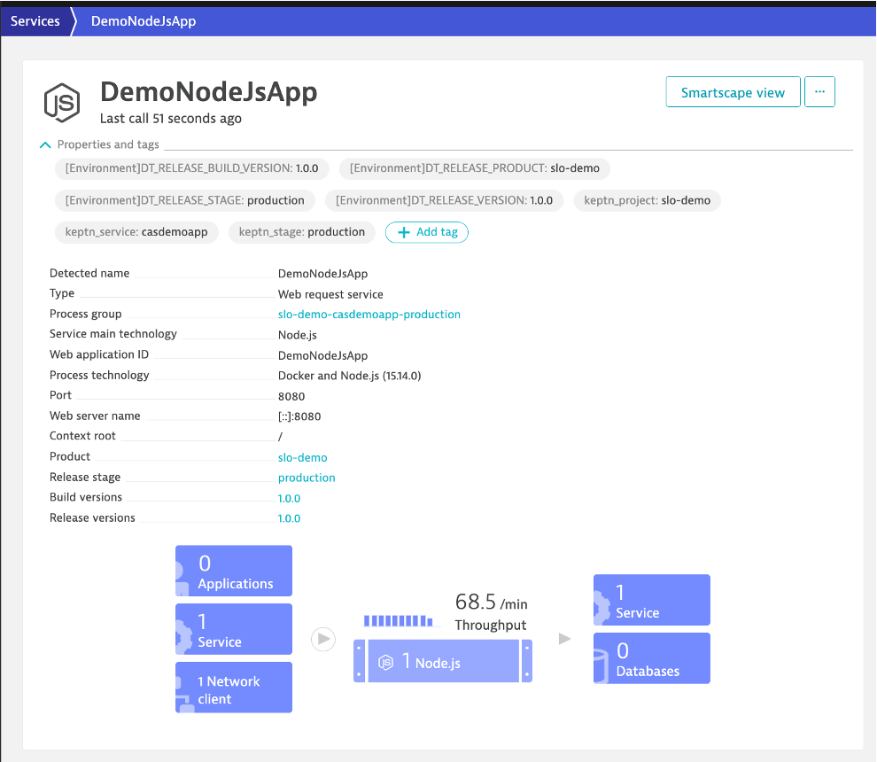
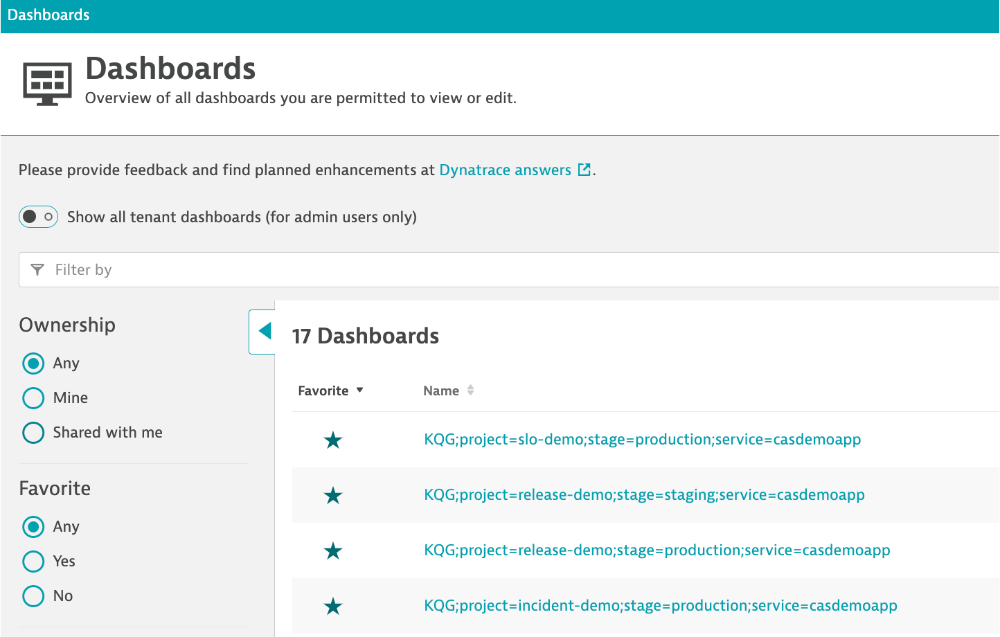

# Start the sample application

Follow these steps to start the sample application and view it in a browser

## Step 1: Start up the sample application with Docker.

1. In the SSH terminal, change to the scripts directory and start up the application

    ```
    cd ~/cloud-automation-quickstart/demoapp
    sudo docker-compose up -d
    ```

1. Verify it us running with this command `sudo docker-compose ps` . The output should look something like:

    ```
    Name                    Command                          State   Ports                
    -----------------------------------------------------------------------------------------------------
    app_casdemoapp1_1       docker-entrypoint.sh npm start   Up      0.0.0.0:80->8080/tcp,:::80->8080/tcp
    app_casdemoapp2_1       docker-entrypoint.sh npm start   Up      0.0.0.0:81->8080/tcp,:::81->8080/tcp
    app_casdemoapp3_1       docker-entrypoint.sh npm start   Up      0.0.0.0:82->8080/tcp,:::82->8080/tcp
    app_casdemoapp4_1       docker-entrypoint.sh npm start   Up      0.0.0.0:83->8080/tcp,:::83->8080/tcp
    app_casdemoappload1_1   sh -c /load.sh ${HOSTNAME} ...   Up                                          
    app_casdemoappload2_1   sh -c /load.sh ${HOSTNAME} ...   Up                                          
    app_casdemoappload3_1   sh -c /load.sh ${HOSTNAME} ...   Up                                          
    app_casdemoappload4_1   sh -c /load.sh ${HOSTNAME} ...   Up  
    ```

## Step 2: View application in a browser

Using the public IP for the virtual machine, open the application with `http://[public-ip]`.  It should look like this:


## Step 3: Review Dynatrace monitorings

To review what is being monitoring in dynatrace, login and open these pages and you should see the following:

1. Open the `services` page to view four services with name of project and stage

    

1. Click on a service to view the tags with the project, service and stage made by the added "auto-tagging" rule found within `Settings-->Tags-->Automatically applied tags`

    

1. Open the `dashboard` page to view four dashboards with name of project and stage. These dashboards will be used for the SLO evaluations

    

# Stop the application

If you need to stop the application, run these commands:

```
cd ~/cloud-automation-quickstart/demoapp
sudo docker-compose down
```

# Other useful commands

The following commands are just reference

* Get [CONTAINER ID] from the `sudo docker ps` command
* Follow logs of a container with `sudo docker logs [CONTAINER ID] -f`  (Use ctrl-c to exit)


<hr>

[](03-DTCONFIG.md) [](05-ONBOARD.md)