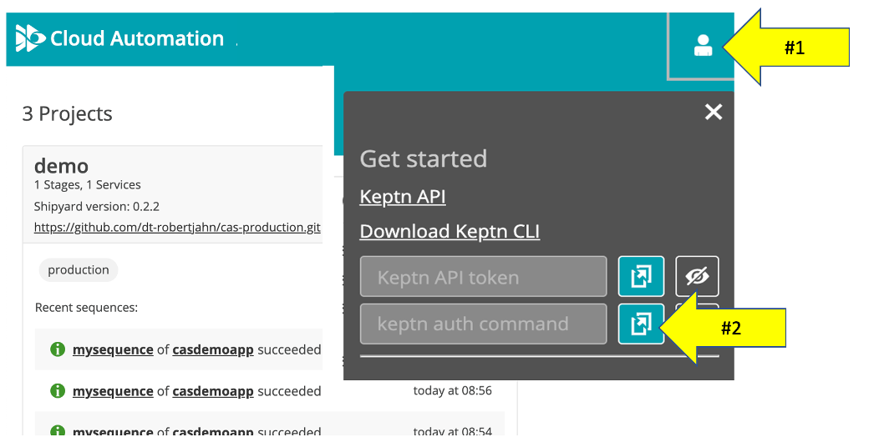
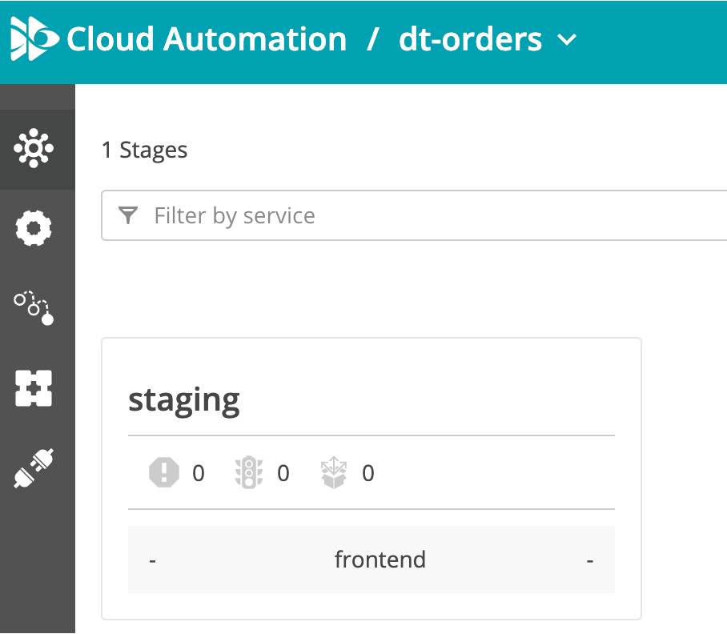
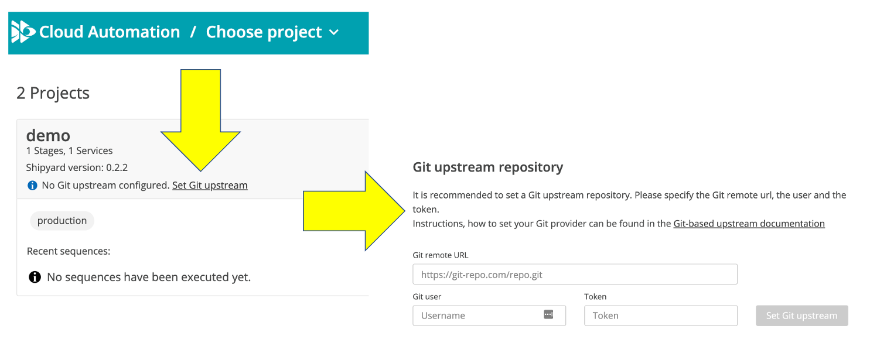
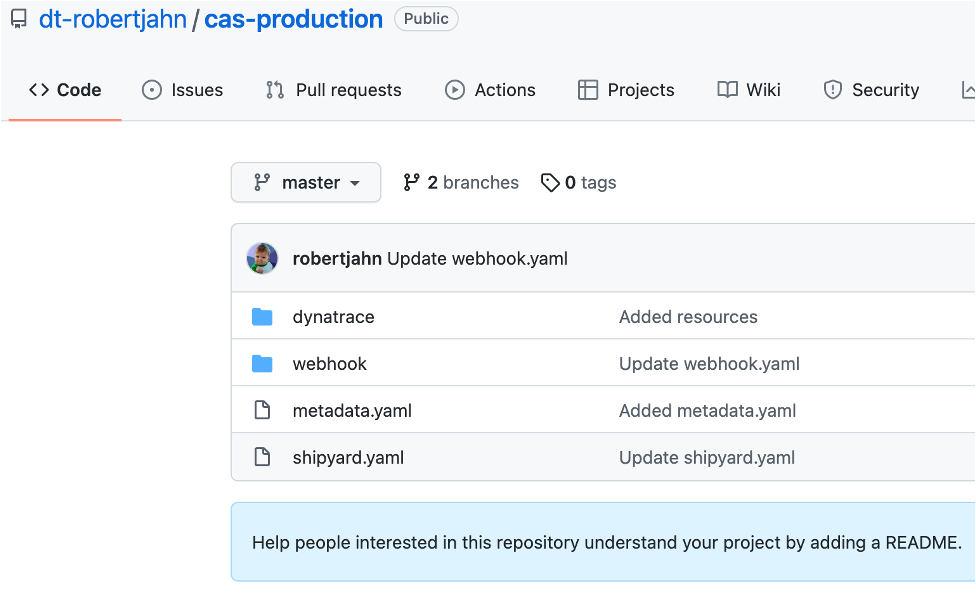
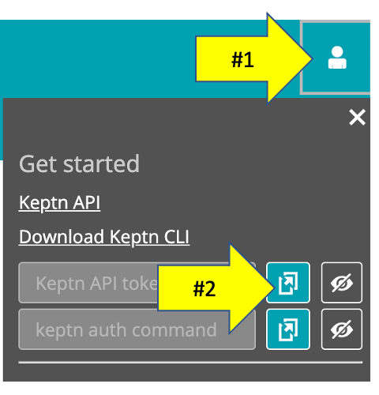
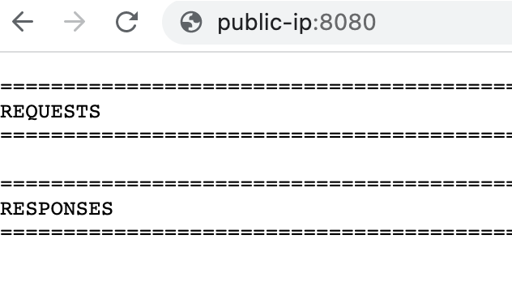

# Onboard sample application to Cloud Automation

The [keptn CLI](https://keptn.sh/docs/0.12.x/reference/cli/) is a command line utility that creates projects, onboarding services, and add new artifact events with CloudAutomation Keptn module. Once the Keptn CLI in downloaded and authenticated, then scripts that call the CLI will automated the onboarding of the demo app within Cloud Automation project. 

Once that is done, you will configure the demo project to connect to a new git repo that stores the project files and setup a Cloud Automation secret with your Dynatrace API token that will be used during SLO evaluations. 

## Step 1: Install and authenticate the Keptn CLI

In the SSH terminal, run these commands to install and authenticate the Keptn CLI

1. Download and install the Keptn CLI

    ```
    curl -sL https://get.keptn.sh | KEPTN_VERSION=0.12.2 sudo -E bash
    ```

1. Since you are not running Keptn in your own Kubernetes instance, run this command to suppress KEPTN CLI messages related to kubectl configuration 

    ```
    keptn set config KubeContextCheck false
    ```

1. Verify the Keptn CLI is installed. Run the `keptn version` command. You should see output similar to this:

    ```
    keptn version

    Keptn CLI version: 0.12.2
    Keptn cluster version: 0.12.2
    ```

## Step 2: Get Credential and Authenticate the CLI

1. Open Cloud Automation web UI.

    

1. Within your Cloud Automation web UI, click on the person icon on the top right to expand the `Get started` popup.  From the popup, use the `copy keptn auth command` button

    

1. In the SSH terminal, authenticate the Keptn CLI by pasting the copied `keptn auth` command from the previous step.  The command you will paste and the output should be similar to this:

    ```
    keptn auth --endpoint=https://[YOUR-URL]/api --api-token=[YOUR_TOKEN]

    Starting to authenticate
    Successfully authenticated against the Keptn cluster https://[YOUR-URL]/api
    ```

## Step 2: Create projects within Cloud Automation

In the SSH terminal, run this command that will automate the process to add a project, service, and supporting project files.

```
cd ~/cloud-automation-quickstart/scripts
./create-projects.sh
```

1. From the Cloud Automation UI, verify that you have three projects as shown below. 

   

## Step 4: Configure project upstream repos

Here you need to create a public git based repository where the Cloud Automation files will be installed.

💥💥💥 **IMPORTANT NOTE** 💥💥💥

```
You must do this in order to view and edit the Cloud Automation project files.
```

1. First setup your repo and access token per this [Create a Git repository Documentation](https://keptn.sh/docs/0.12.x/manage/git_upstream/).  You need to make three BLANK repos with these titles in the name:
    * `slo-demo`
    * `incident-demo`
    * `release-demo`

    NOTE: You can customize these names, but you need three as to map to three projects being created.  You can view my repos [here](https://github.com/orgs/dt-robertjahn/repositories?type=all) where I added a prefix of my Cloud Automation environment `https://rob00334.cloudautomation.live.dynatrace.com`

1. Once you have your repo and token, on the Cloud Automation Web UI, on the  `slo-demo` project tile, click on the URL to `Set the GIT upstream` repo as shown below:

    

1. Once the configuration is saved, then verify your repo has been updated.  It should look as shown below:

    

1. Repeat steps 2 and 3 to link the GIT upstream repo for both the `incident-demo` and `release-demo` projects.

## Step 5: Startup the Mock third party service

This [Mock third party application](mockthirdparty/README.md) is used later in the demo webhook subscriptions.  It will receive requests and send back Cloud Automation Events. 

In the SSH terminal, perform these steps

1. Open the mockthirdparty folder
    ```
    cd ~/cloud-automation-quickstart/mockthirdparty
    ```
1. The `docker-compose.yaml` script uses an environment file called `.env` to store credentials. To make this, copy the `env.template` file to a files named `.env`

    ```
    cp env.template .env
    ```
1. Get your Cloud Automation token

    

1. In the `.env` file, adjust values for `KEPTN_BASEURL` and `KEPTN_API_TOKEN`
    * `KEPTN_BASEURL` is just for example `https://abc.cloudautomation.live.dynatrace.com` with no `\` at the end
    * `KEPTN_API_TOKEN` is the API token from this same environment 
1. Start up the application
    ```
    sudo docker-compose up -d
    ```
1. Verify its running

    ```
    sudo docker ps
    ```

    you should see, something like
    ```
    CONTAINER ID   IMAGE                          COMMAND                  CREATED         STATUS         PORTS                                       NAMES
    1986da43a9a7   dtdemos/mockthirdparty:1.0.0   "python3 ./app.py"       2 minutes ago   Up 2 minutes   0.0.0.0:8080->5000/tcp, :::8080->5000/tcp   ec2-user_demoapp_1
    ```

1. View application in a browser. Using the public IP for the virtual machine, open the application with `http://[PUBLIC IP OF YOUR VM WITH THE MOCK SERVICE]:8080`.  There are no logs yet, so the page should just look like this for now:

    

NOTE: If you need to stop the Mock third party application, just run

```
cd ~/cloud-automation-quickstart/mockthirdparty
sudo docker-compose down
```

<hr>

[](04-APP.md) [](10-WEBHOOK.md)