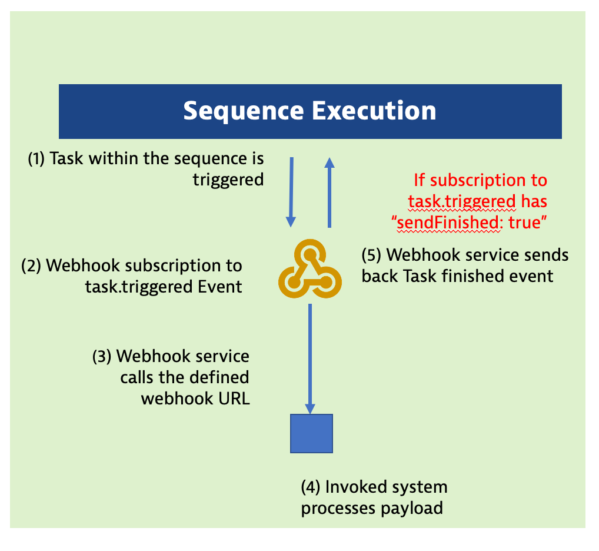
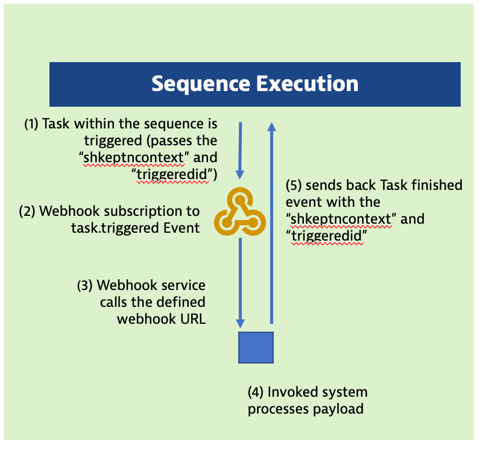

# Webhooks overview

Cloud Automation has a built-in capability, via the [webhook service](https://github.com/keptn/keptn/tree/master/webhook-service), to call external HTTP endpoints as part of sequence task orchestration. 

Webhooks allow you to easily integrate various third-party tools such as testing services, CI/CD pipelines, and incident management services. In addition to just invoking the third-party webhook receiver, webhook subscriptions can be configured to wait for the third-party webhook receiver to send back details about what it did. 

Depending on the receiving tools configuration requirements, data can be either passed within the payload body or as query params in the URL along with any required headers and API tokens.

# Webhook use cases

Below are two example use cases for integrating third party tools using the event-based integrations platform for task such as deployment, testing, notification.

## Software Test and Release


## Incident Management and Problem Remediation 


# Webhook subscriptions

Webhook configurations, referred to as subscriptions, are created at a *Task* level and are configured to listen to one of the the following task [event types](https://github.com/keptn/spec/blob/0.2.2/cloudevents.md#task-events):

| Event types     | Description                                           |
|---------------- |-----------------------------------------------------  |
| Task triggered  | The task has been triggered but is not yet running.   |
| Task started    | The task has begun running.                           |
| Task finished   | The task has finished.                                |

## Webhook service subscription Types

Broadly, there are two types of webhook service subscription types:

1. *Passive* - These subscriptions just call a third-party webhook receiver and there are two variants. 
    * Subscribe to a task `started` or `finished` events. 
    * Subscribe to a task `triggered` event and the webhook service sends both the task `started` event and the task `finished` event to complete the sequence task.  
1. *Active* - These subscriptions subscribe to a task `triggered` event and the webhook service sends the task `started` event.  The sequence then waits for the third-party webhook receiver to send back a task `finished` event to complete the sequence task.

# #1 Passive subscription for on task "finished" events

For this use case, a webhook subscription is configured to listen to a task `started` or `finished` event. For this to work, some other service is responsible to send the task `started` and `finished` events to complete the sequence task.

One example is the `evaluation` task. Here the evaluation service sends the evaluation `started` and `finished` event with Service Level Objective (SLO) evaluation results. By subscribing to the `finished` event, the SLO results can be sent to some third-party webhook receiver such as Slack.

Refer to the picture below:


For this subscription, this option is left empty:


# #2 Passive subscription for on task "triggered" events

For this use case, the webhook service sends both the task `started` and task `finished` events to complete the task sequence. 

An example *Passive* webhook is setting a feature flag where the third-party webhook receiver can't send confirmation that it set the flag.

Refer to the picture below:



For this subscription, choose this option:


# #3 Active subscription for on task "triggered" events

This type is called *Active* because the webhook service will first send the task `started` event and the third-party webhook receiver sends back the `finished` task event to complete the task sequence.

An example *Active* webhook is to trigger a system to open an incident management ticket and send back the newly created incident ticket number within the task `finished` event so that the sequence can continue.

*Important Note:* 

* If the third-party webhook receiver does NOT send back the task `finished` event, the sequence will remain in a waiting states and will not continue until it times out or the it receives the task `finished` event.

Refer to the picture below:



For this subscription, choose this option:


# Active subscription - Sending back the "finished" cloud event

The receiving system receives the webhook payload, does work, then send back a task `finished` event.  

An example request payload from the webhook subscription to a receiving system is:

```
{
  "data": {
    "project": "release-demo",
    "service": "casdemoapp",
    "stage": "staging"
  },
  "shkeptncontext": "6e7bc693-1dd2-4ab4-8a65-91949312d23c",
  "id": "a136fbc9-7a2e-4cf2-9e37-4f8c7b35ca18",
  "type": "sh.keptn.event.deployment.triggered"
}
```

The cloud event sent by receiving system using the Cloud Automation API must be:

* url: `https://${YOUR_CLOUD_AUTOMATION_BASE_URL}/api/v1/event`
* method: `POST`
* Headers:
    * Accept: application/json
    * Content-Type: application/json
    * x-token: YOUR_CLOUD_AUTOMATION_KEPTN_API_TOKEN
* Body:
    ```
    {
        "data": {
            "project":"TRIGGERED EVENT PROJECT",
            "stage":"TRIGGERED EVENT STAGE",
            "service": "TRIGGERED EVENT SERVICE",
            "status": "succeeded",
            "result": "pass"
        },
        "source": "REPLACE WITH NAME THAT INDICATES SOURCE OF EVENT",
        "specversion": "1.0",
        "type": "sh.keptn.event.[THE_TASK_NAME].finished",
        "shkeptncontext": "REPLACE WITH TRIGGERED EVENT shkeptncontext VALUE",
        "triggeredid": "REPLACE WITH TRIGGERED EVENT id VALUE"
    }
    ```

    As reference:
    * `data.status` expresses the task execution itself, meaning could the receiving system execute the task. Valid values are: `succeeded`, `errored`, `unknown`
    * `data.result` expresses the result of the task execution. Valid values are: `pass`, `warning`, `fail`


<hr>

[](05-ONBOARD.md) [](11-SLO.md)