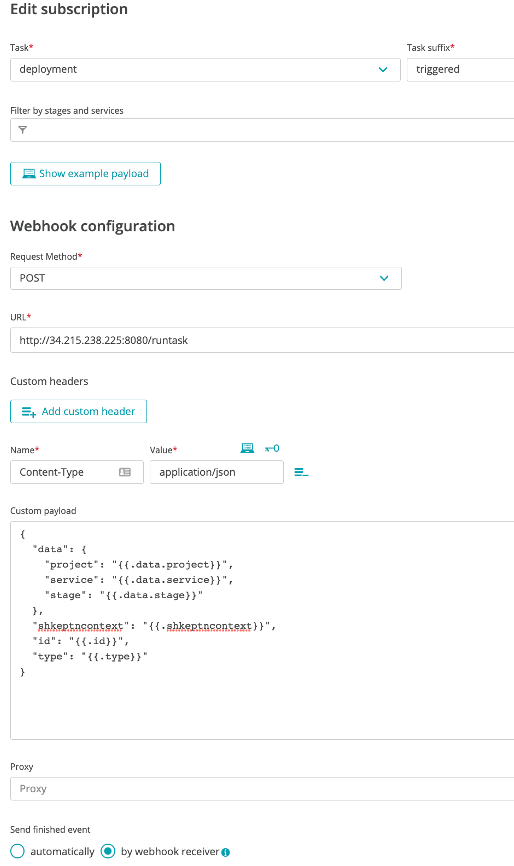
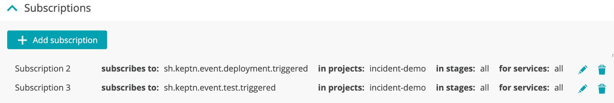
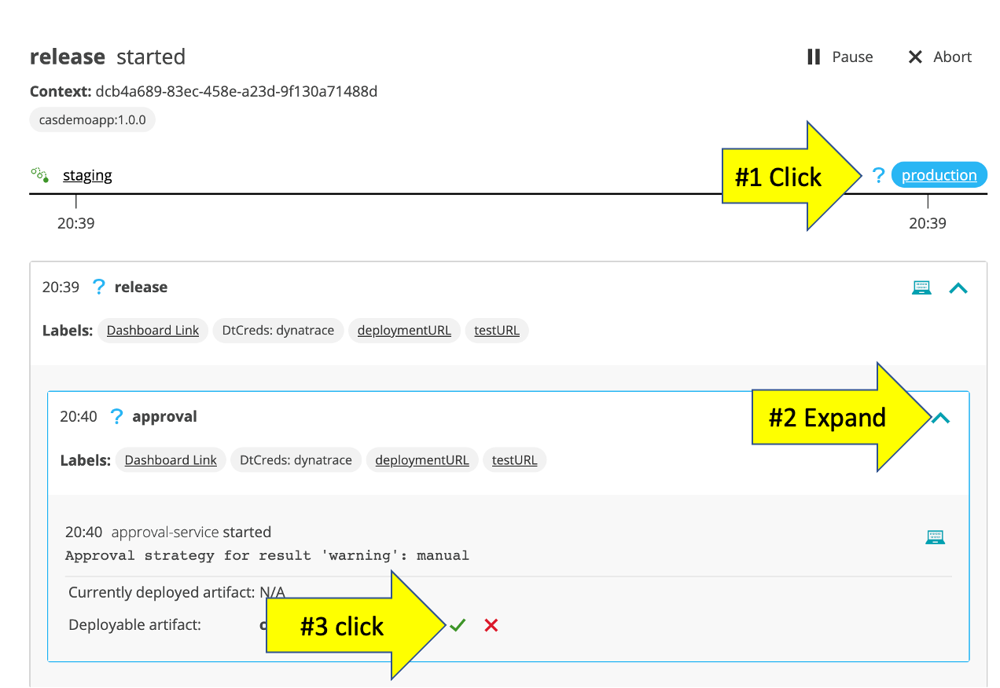
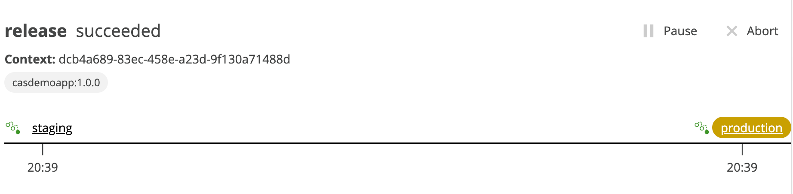
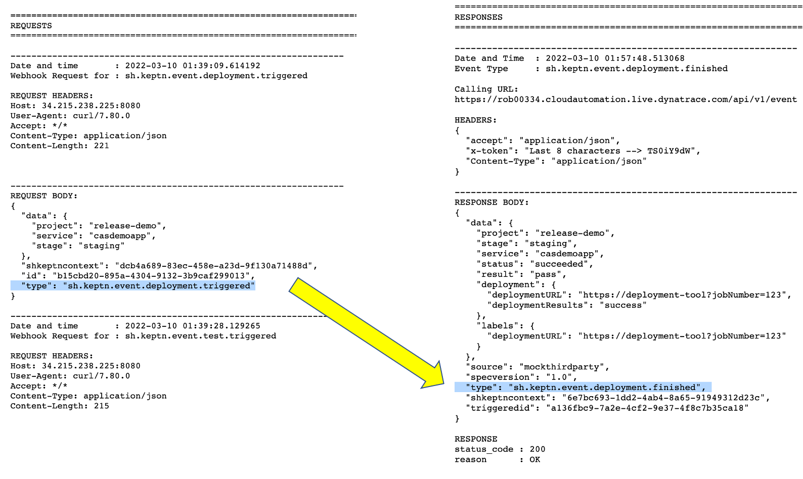
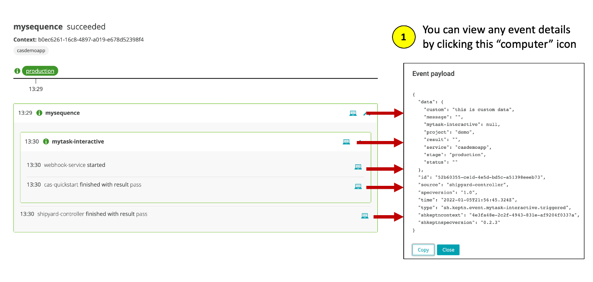
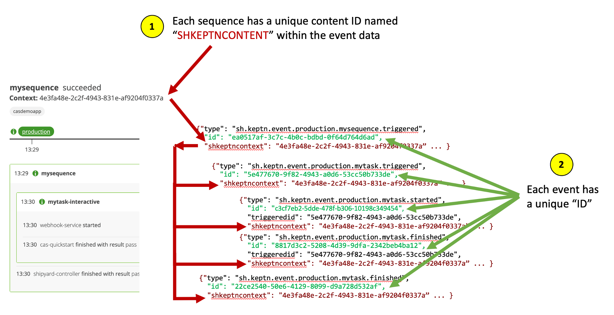
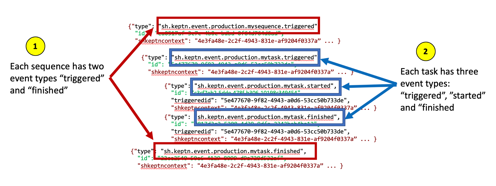
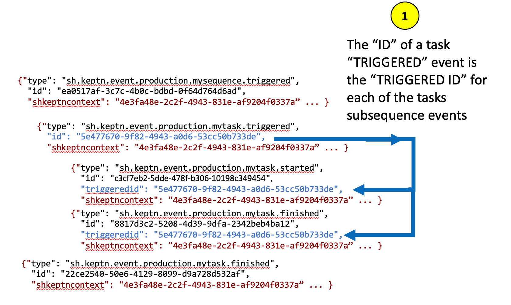

# Release demo

For this use case you will run a multi-stage release sequence. Your webhooks will trigger the [Mock third party application](mockthirdparty/README.md) that you setup earlier.

# Review shipyard file with the evaluation task

Navigate to your GIT `release-demo` project and open the `shipyard.yaml` file that is in the root folder.  

In this you will see two stages `staging` and `production` each with a sequence called `release` with multiple tasks. 
* The `deployment` and `test` are custom tasks that you will add a webhook subscription to.  
* The `evaluation` task will just run to get SLO results.  
* The `approval` is a reserved task that will prompt for manual approval within the `production` stage of the sequence as it executes. See [Keptn Docs](https://keptn.sh/docs/0.12.x/manage/shipyard/#approval) for more details on this task.

# Configure webhooks

### Step 1: Configure "deployment.triggered" webhook

1. From the Cloud Automation UI, click on the `release-demo` project`

1. On the left menu click on the `Uniform` option

1. Click on the `webhook-service`

1. Click the `Add subscription` button

1. On the `New subscription` page, fill in the following values as shown below.
    * task = `deployment`
    * Task suffix = `triggered`
    * request method = `POST`
    * URL = http://[PUBLIC IP OF YOUR VM WITH THE MOCK SERVICE]:8080/runtask
    * Custom header = Content-Type application/json
    * custom payload below
        ```
        {
            "data": {
                "project": "{{.data.project}}",
                "service": "{{.data.service}}",
                "stage": "{{.data.stage}}"
            },
            "shkeptncontext": "{{.shkeptncontext}}",
            "id": "{{.id}}",
            "type": "{{.type}}"
        }
        ```
    * Send finished event = "by webhook receiver"

    It should look as follows:

    

1. Click the `Create subscription` button

### Step 2: Configure "test.triggered" webhook

This is the same as the previous webhook, but the event type is "test"

1. On the left menu click on the `Uniform` option

1. Click on the `webhook-service`

1. Click the `Add subscription` button

1. On the `New subscription` page, fill in the following values as shown below.
    * task = `test`
    * Task suffix = `triggered`
    * request method = `POST`
    * URL = http://[PUBLIC IP OF YOUR VM WITH THE MOCK SERVICE]:8080/runtask
    * Custom header = Content-Type application/json
    * custom payload below
        ```
        {
            "data": {
                "project": "{{.data.project}}",
                "service": "{{.data.service}}",
                "stage": "{{.data.stage}}"
            },
            "shkeptncontext": "{{.shkeptncontext}}",
            "id": "{{.id}}",
            "type": "{{.type}}"
        }
        ```
    * Send finished event = "by webhook receiver"

### Step 3: Review

The webhooks should look like this



# Trigger sequence

Take a look at [this](projects/release-demo/events/sh.keptn.event.staging.release.triggered.json) file in the project to see what will be passed in.  This is simulating what some tool or code commit trigger might send in.

### Step 1: Reset the mockservice logs.  

In a browser, paste and open this URL: `http://[PUBLIC IP OF YOUR VM WITH THE MOCK SERVICE]:8080/resetlog`.  The page should show this message: `Reset Logs complete`

### Step 2: Trigger sequence

1. To trigger the sequence, from the SSH terminal run this command

    ```
    cd ~/cloud-automation-quickstart/scripts
    ./trigger.sh
    ```

1. This will prompt for a menu, choose option value of `2` as shown below.

    ```
    =============================================================================
    2) RELEASE-DEMO  - Send 'sh.keptn.event.staging.release.triggered' event
    -----------------------------------------------------------------------------
    q) quit and exit
    =============================================================================
    Pick the number for the event to trigger : 2

    Running 'keptn send event --file ../projects/release-demo/events/sh.keptn.event.staging.release.triggered.json'
    OUTPUT = ID of Keptn context: 409d7b25-d04b-44f3-a636-d2fc8d67819a
    ```

### Step 3: Review Sequence

Monitor the sequence progress in the Cloud Automation UI.  Once the sequence is complete, you can expand each task and click on the `computer` icon within the sequence view the cloud event details.

Once the `evalation` task is complete, the sequence should look look this. Expand the tasks to see that the mock service finished the tasks.


### Step 4: Approve Sequence

Since is a multi-stage sequence with a manual approval, you need to click on the `production` sequence, expand the approval task and approve the task for the sequence to fully complete. 



Once approved, the file sequence will look like this: 



### Step 5: Review Mock Service Log

View mock service logs in a browser. Using the public IP for the virtual machine, open the application with `http://[PUBLIC IP OF YOUR VM WITH THE MOCK SERVICE]:8080`.  

The log should look like this and notice:
* Each task `triggered` event has a corresponding task `finished` event. For example `sh.keptn.event.deployment.triggered` and `sh.keptn.event.deployment.finished`
* The `shkeptncontext` is the same in request and response
* The `id` in the request is the `triggeredid` in the response
* The `project`, `'service`, `stage` in the request are in the response
* Mocked data is passed back in the `labels` response attribute.  This is then shown in the bridge
* Mocked data is passed back in the `deployment` response attribute.  This is appended to the subsequent cloud `triggered` events.  This allows the next task to then have this information available to it.



# Understand Cloud Events and IDs

Get familiar with the cloud events that are taking place within the sequence. You can click the computer icon next to the sequence, task and task events as shown in this example below.



Notice too how each sequence has a unique content ID named `SHKEPTNCONTENT` within the event data and how each event has a unique `ID`.
 


Notice too how each sequence has two event types `triggered` and `finished` and each task has three event types: `triggered`, `started` and `finished`.



💥💥💥 **IMPORTANT NOTE** 💥💥💥

Lastly, notice how the `ID` of a task `TRIGGERED` event is the `TRIGGERED ID` for each of the tasks subsequence events.  Understanding the `TRIGGERED ID` is important for `active` webhooks subscriptions.




<hr>

[](11-SLO.md) [](13-INCIDENT.md)