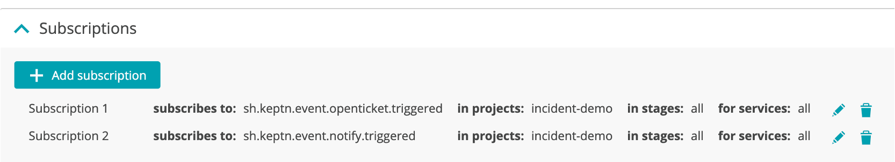
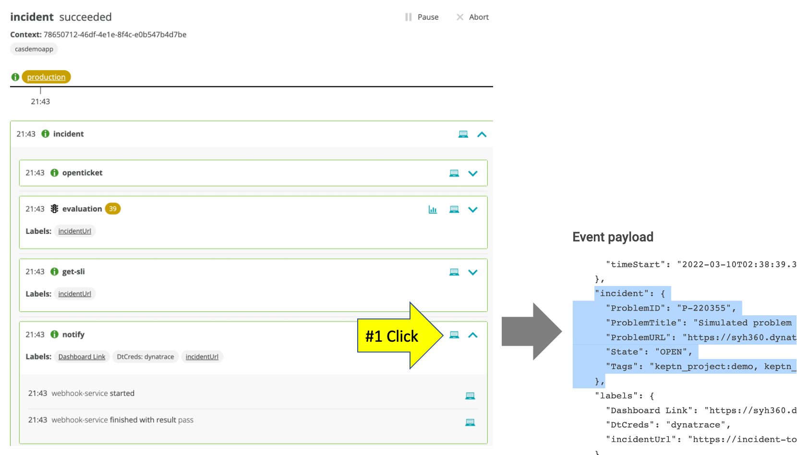
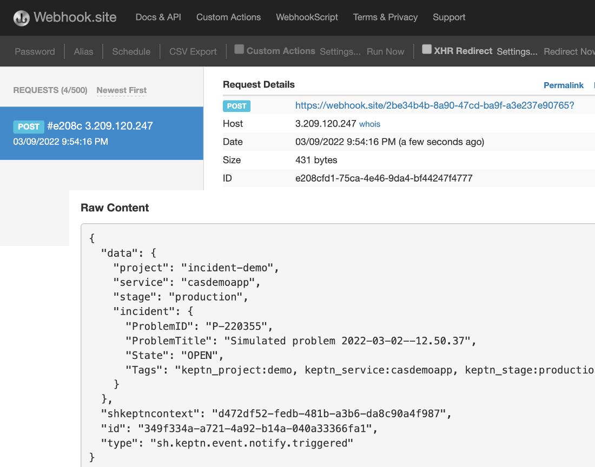
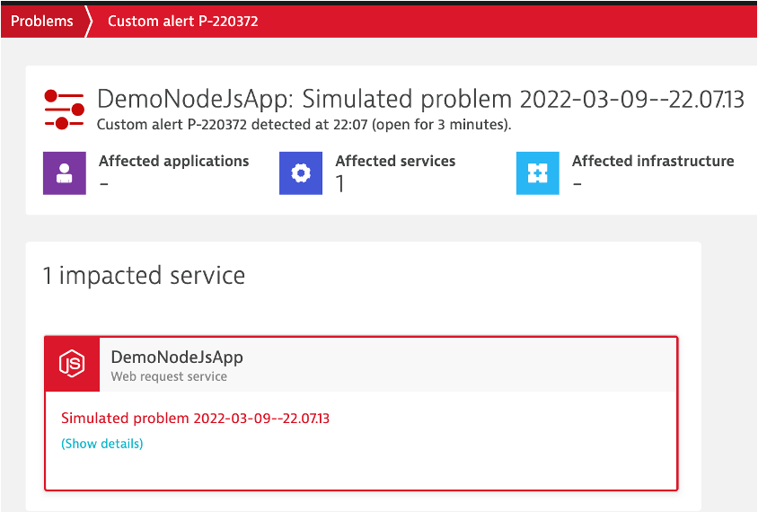

# Incident Management

For this use case you will run a incident management sequence. Your webhook will trigger the [Mock third party application](mockthirdparty/README.md) that you setup earlier.  It will send out a notification to the webhook.site

# Review shipyard file with the evaluation task

Navigate to your GIT `incident-demo` project and open the `shipyard.yaml` file that is in the root folder.  

In this you will see a stage `production` each with a sequence called `incident` with multiple tasks.  
* The `openticket` and `notify` are custom tasks that you will add a webhook subscription to.  
* The `evaluation` task will just run to get SLO results.

# Configure webhooks

### Step 1: Configure "openticket.triggered" webhook

1. From the Cloud Automation UI, click on the `incident-demo` project`

1. On the left menu click on the `Uniform` option

1. Click on the `webhook-service`

1. Click the `Add subscription` button

1. On the `New subscription` page, fill in the following values as shown below.
    * task = `openticket`
    * Task suffix = `triggered`
    * request method = `POST`
    * URL = http://[PUBLIC IP OF YOUR VM WITH THE MOCK SERVICE]:8080/runtask
    * Custom header = Content-Type application/json
    * custom payload below
        ```
        {
            "data": {
                "project": "{{.data.project}}",
                "service": "{{.data.service}}",
                "stage": "{{.data.stage}}"
            },
            "shkeptncontext": "{{.shkeptncontext}}",
            "id": "{{.id}}",
            "type": "{{.type}}"
        }
        ```
    * Send finished event = "by webhook receiver"

### Step 2: Configure "notify.triggered" webhook

1. On the left menu click on the `Uniform` option

1. Click on the `webhook-service`

1. Click the `Add subscription` button

1. On the `New subscription` page, fill in the following values as shown below.
    * task = `notify`
    * Task suffix = `triggered`
    * request method = `POST`
    * URL = the wehbook.site URL you copied
    * custom payload below
        ```
        {
            "data": {
                "project": "{{.data.project}}",
                "service": "{{.data.service}}",
                "stage": "{{.data.stage}}",
                "incident": {
                "ProblemID": "{{.data.incident.ProblemID}}",
                "ProblemTitle": "{{.data.incident.ProblemTitle}}",
                "State": "{{.data.incident.State}}",
                "Tags": "{{.data.incident.Tags}}"
                }
            },
            "shkeptncontext": "{{.shkeptncontext}}",
            "id": "{{.id}}",
            "type": "{{.type}}"
        }
        ```
    * Send finished event = "automatically"

1. Click the `Create subscription` button

### Step 3: Review

The webhooks should look like this



# Trigger sequence

Take a look at [this](projects/incident-demo/events/sh.keptn.event.production.incident.triggered.json) file in the project to see what will be passed in.  This is simulating what Dynatrace would send in for a problem notification.

### Step 1: Reset the mockservice logs.  

In a browser, paste and open this URL: `http://[PUBLIC IP OF YOUR VM WITH THE MOCK SERVICE]:8080/resetlog`.  The page should show this message: `Reset Logs complete`

### Step 2: Trigger sequence

1. To trigger the sequence, from the SSH terminal run this command

    ```
    cd ~/cloud-automation-quickstart/scripts
    ./trigger.sh
    ```

1. This will prompt for a menu, choose option value of `3` as shown below.

    ```
    =============================================================================
    3) INCIDENT-DEMO - Send 'sh.keptn.event.production.incident.triggered' event
    -----------------------------------------------------------------------------
    q) quit and exit
    =============================================================================
    Pick the number for the event to trigger : 3

    Running 'keptn send event --file ../projects/incident-demo/events/sh.keptn.event.production.incident.triggered.json'
    OUTPUT = ID of Keptn context: 409d7b25-d04b-44f3-a636-d2fc8d67819a
    ```

### Step 3: Review Sequence

Monitor the sequence progress in the Cloud Automation UI.  Once the sequence is complete, you can expand each task and click on the `computer` icon within the sequence view the cloud event details.

Once the `notify` task is complete, the sequence should look look this. Expand the tasks to see that the mock service finished the tasks.  Click on the `notify` computer icon to see the event with the incident attribute that was populated by the mock service during the openticket task.



### Step 4: Review webhook site

In the webhook.site to view the generated notification.



### Step 5: Review Mock Service Log

View mock service logs in a browser. Using the public IP for the virtual machine, open the application with `http://[PUBLIC IP OF YOUR VM WITH THE MOCK SERVICE]:8080`.  


# OPTIONAL STEP - Setup a Dynatrace problem webhook

If you want to see Dynatrace send the cloud event to start the incident management sequence, then follow these steps.

### Step 1: Configure Dynatrace problem notification

1. In Dynatrace, navigate to `Settings > Integration > Problem notifications`
1. Create a new Problem notification with the following settings:
    * Notification Type: `Custom Integration`
    * Display Name: `Dynatrace Cloud Automation`
    * Webhook URL: `[YOUR CLOUD AUTOMATION BASE URL]/api/v1/event`
    * Additional Header 1
        * Name: `x-token`
        * Secret Header value: `Yes`
        * Value: `[YOUR CLOUD AUTOMATION KEPTN API TOKEN]`
    * Additional Header 1
        * Name: `Content-Type`
        * Secret Header value: `No`
        * Value: `application/cloudevents+json`
    * Payload
    
        Use the JSON payload below, but replace the ProblemURL string with the URL from your environment:
        ```
        "ProblemURL":"https://[YOUR-ENVIRONMENT]/ui/problems?displayId={ProblemID}"
        ```
        For example:
        ```
        "ProblemURL":"https://abcd.live.dynatrace.com/ui/problems?displayId={ProblemID}"
        ```

        ```
        {
            "specversion":"1.0",
            "source":"dynatrace notifications webhook",
            "contenttype":"application/json",
            "type": "sh.keptn.event.production.incident.triggered",
            "data": {
                "project":"incident-demo",
                "stage":"production",
                "service":"casdemoapp",
                "dynatraceProblem": {
                    "State":"{State}",
                    "ProblemID":"{ProblemID}",
                    "PID":"{PID}",
                    "ProblemTitle":"{ProblemTitle}",
                    "ProblemURL":"https://[YOUR-ENVIRONMENT]/ui/problems?displayId={ProblemID}",
                    "ProblemDetails":{ProblemDetailsJSON},
                    "Tags":"{Tags}",
                    "ImpactedEntities":{ImpactedEntities},
                    "ImpactedEntity":"{ImpactedEntity}"
                }
            }
        }
        ```
1. Click the `test notification` button
1. This should start a sequence.  If that worked, then save the problem notification in Dynatrace.

### Step 2: Create a Dynatrace problem

The `scripts/simulate-dynatrace-problem.sh` script was made to automate the calling of the [Dynatrace Events APIs](https://www.dynatrace.com/support/help/dynatrace-api/environment-api/events-v2/post-event) to force a "fake" problem.  

By doing this, the Dynatrace problem notification you just setup will be triggered and thus starting the incidement management cloud automation sequence.  The problem will have the timestamp in the title as to make it unique as shown here.



To run the script, run these commands

```
cd ~/cloud-automation-quickstart/scripts
./simulate-dynatrace-problem.s
```

The output will look like and a sequence should start within cloud automation.

```
=============================================================
Sending 'CUSTOM_ALERT' event to 
https://syh360.dynatrace-managed.com/e/1c819cc7-d7f5-40d9-b90f-b80c8610a392
=============================================================
==============================================================
SENDING THE FOLLOWING HTTP PAYLOAD TO 
  https://syh360.dynatrace-managed.com/e/1c819cc7-d7f5-40d9-b90f-b80c8610a392/api/v2/events/ingest
==============================================================
{ "title": "Simulated problem 2022-03-09--22.07.13", "eventType": "CUSTOM_ALERT", "source" : "cloud-automation-quickstart", "description" : "There was a problem detected which should trigger the Cloud Automation Sequence", "entitySelector": "type(SERVICE),entityName(DemoNodeJsApp),tag(keptn_project:demo,keptn_service:casdemoapp,keptn_stage:production)", "properties":{ "Triggered by": "simulate-problem.sh" } }
==============================================================
API RESPONSE:
==============================================================
{"reportCount":1,"eventIngestResults":[{"correlationId":"29028bcb58ef4998","status":"OK"}]}
```

### Step 3: Close Dynatrace problem

Manually close the problem the Dynatrace and click the `close problem` button on the top right side.  

<hr>

[](12-RELEASE.md) [](20-BUILDWEBHOOK.md)