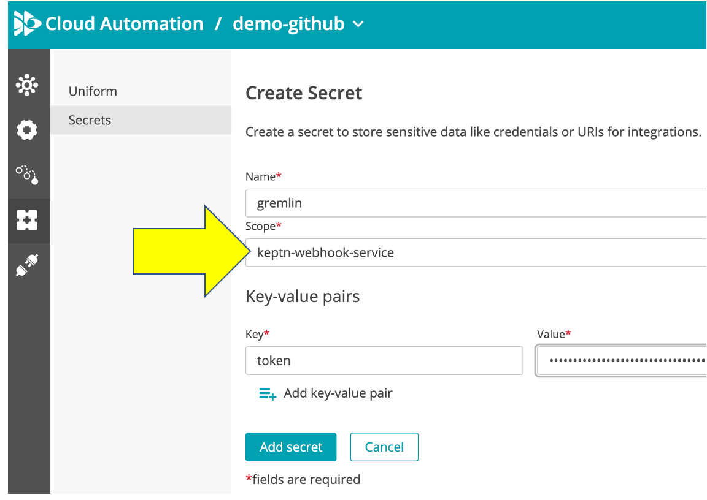

# Build your own webhook

Now that you have seen and executed both types of webhooks, its time to define your own.  Below is a table of some of the possibilities.  But keep in mind a task will be part of sequences, so they can be reusable to different use cases like testing or problem management.

# Webhook examples

Before you start, I encourage you to review these videos:

* [Cloud Automation Webhooks for Slack video](https://www.youtube.com/watch?v=0vJS7ecayGw&t=267s)
* [Cloud Automation Webhooks for GitHub Actions video](https://www.youtube.com/watch?v=d32WHNmtqOs)

# Example Use Cases for webhooks

## Software Test and Release

| Task Category         | Silent Webhook                                                               | Interactive Webhook                                                                                                                                               |
|-----------------------|------------------------------------------------------------------------------|-------------------------------------------------------------------------------------------------------------------------------------------------------------------|
| Chaos Testing         | Trigger a Test to start                                                      | Trigger and send back results of test                                                                                                                             |
|                       | Trigger a Test to stop                                                       | Trigger and send back confirmation it stopped                                                                                                                     |
| CI/CD                 | Trigger a Build                                                              | Trigger and send back results of job                                                                                                                              |
|                       | Trigger a Deployment                                                         | Trigger and send back results of job                                                                                                                              |
| Optimization Modeling | Trigger a Model to start                                                     | Trigger and send back results of execution                                                                                                                        |
|                       | Trigger a Model to stop                                                      | Trigger and send back confirmation it stopped                                                                                                                     |
| Feature Flags         | Set a Flag ON / OFF                                                          | Set a Flag ON / OFF with confirmation status of update                                                                                                            |
| Issue Ticketing       | Open an Issue                                                                | Open and send back issue #                                                                                                                                        |
|                       | Update an Issue                                                              | Update and send back confirmation                                                                                                                                 |
|                       | Close an Issue                                                               | Close and send back confirmation                                                                                                                                  |
| Load Testing          | Trigger a Test to start                                                      | Trigger and send back results of test                                                                                                                             |
|                       | Trigger a Test to stop                                                       | Trigger and send back confirmation it stopped                                                                                                                     |
| Notification          | Push update for SLO, Deployment, etc.                                        | Approval: Handle approval triggered, send back an approval.started and the .finished when the user in the notification tool clicked on “approved” or “rejected” " |

## Incident Management and Problem Remediation

| Task Category         | Silent Webhook                                                               | Interactive Webhook                                                                                                                                               |
|-----------------------|------------------------------------------------------------------------------|-------------------------------------------------------------------------------------------------------------------------------------------------------------------|
| Incident Management   | Open a Ticket                                                                | Open and send back ticket #                                                                                                                                       |
|                       | Update a Ticket                                                              | Update and send back confirmation                                                                                                                                 |
|                       | Close a Ticket                                                               | Close and send back confirmation                                                                                                                                  |
| Feature Flags         | Set a Flag ON / OFF                                                          | Set a Flag ON / OFF with confirmation status of update                                                                                                            |
| Remediation           | Run automated remediation runbook, Examples: Toggle Feature Flag, Run CD job | Trigger a remediation action and send back results of job                                                                                                         |
| Notification          | Push update for SLO, Deployment, etc.                                        | Approval: Handle approval triggered, send back an approval.started and the .finished when the user in the notification tool clicked on “approved” or “rejected” " |

# Suggested Recipe

1. Determine the best interface of the downstream platform to configure a Cloud Automation webhook against. For example, a configurable an inbound webhook or an API. If yes, then a Cloud Automation silent or interactive pattern is possible.
1. Determine if the downstream platform supports the ability to make the Cloud Automation API call to send back a task `finished` event using an API call. If yes, then a Cloud Automation `active` pattern is possible. For example, this could be implemented as:
    * use customer definable scripts
    * Predefined templates
    * This is one example for reference: https://artifacthub.io/packages/keptn/keptn-integrations/githubaction
1. If the `active` pattern is possible, also determine how a user would manage the the Cloud Automation URL and Token as secrets
1. Define one or more use cases
1. For each use case, review the interfaces HTTP method, headers, auth credentials, and payload requirements and map to how the Cloud Automation webhook would be configured
1. Setup a downstream platform account to use for development and testing
1. If creating an `active` use case, develop the script or template that will process the webhook and send back the event to the Cloud Automation API
1. Setup and test Cloud Automation webhooks to the downstream platform.
    * Delete the existing webhooks from the demos
    * Configure configure webhooks to the downstream platform API or webhooks
    * Setup your own way to trigger a sequence or reuse the `trigger.sh` script from this quick start guide to trigger a sequence
1. Document the example
1. Demo and get feedback
1. Consider posting to the [Keptn artifact hub too](https://github.com/keptn-contrib/artifacthub)

# Tips

## #1 - Enhancements/Bug Issue List

Here are some items that may impact you:

* [Webhook: HTTP call containing semicolon fails](https://github.com/keptn/keptn/issues/7042)
* [Webhook: Extend Payload placeholders to reference full Cloud Event Payload](https://github.com/keptn/keptn/issues/6661)
* [Webhook: Allow filtering for data.result of event](https://github.com/keptn/keptn/issues/6010)
* [Webhook: Allow the the URL use a secret](https://github.com/keptn/keptn/issues/6727)
* [Webhook: line breaks Breaking webhook curl requests](https://github.com/keptn/keptn/issues/6998)
* [Webhook: Add webhook payload preview](https://github.com/keptn/keptn/issues/6794)
* [Webhook: Add Test webhook configuration](https://github.com/keptn/keptn/issues/5261)
* [Bridge: Add checkbox to set the sendStarted flag ](https://github.com/keptn/keptn/issues/6059)
* [Bridge: task subscriptions UI does not provide a way to re-create a subscription for all events](https://github.com/keptn/keptn/issues/6627)
* [Bridge: Trigger a sequence](https://github.com/keptn/keptn/pull/6958)
* [Bridge: Restructuring of Bridge settings for project](https://github.com/keptn/keptn/issues/5282)
* [Bridge: Show secret scope and keys in overview table](https://github.com/keptn/keptn/issues/6296)
* [CLI: Expand keptn to trigger any sequence](https://github.com/keptn/keptn/issues/7032)

## #2 - Use Secrets 

As you setup your webhook, add your API token as a Cloud Automation Secret and use it within subscription page to add it to your URL or Auth header.  For example:

💥💥💥 **IMPORTANT NOTE** 💥💥💥

Pick `keptn-webhook-service` as the Scope



This way your token will NOT be saved in the GIT project in clear text.  This is an example of what gets saved to the `webhook.yaml` file.

```
...
- type: sh.keptn.event.evaluation.finished
requests:
- "curl --header 'Authorization: Bearer {{.env.secret_gremlin_token}}'
    --header 'Content-Type: application/json' --request POST --data
    '{\"hypothesis\":\"Traffic will be load-balanced to the two unaffected
    hosts.\"}'
    https://api.gremlin.com/v1/scenarios/7689a9ce-54dc-4015-89a9-ce54dcc0\
    1533/runs?teamId=54a4a0b0-c54d-4e4c-a4a0-b0c54d5e4c7a"
...
```

## #3 - Add Content-Type in the header

Many APIs require `Content-Type: application/json` so be sure to add that. And use the the "key" icon to add your secrets.


## #4 - Invite others to collaborate

Follow [these instructions](21-USERADMIN.md) for adding users.

# Resources

See the [Dynatrace Lifecycle orchestration Docs](https://www.dynatrace.com/support/help/how-to-use-dynatrace/cloud-automation/lifecycle-orchestration#integrate-external-tools-with-webhooks) for additional details as well as the [Keptn Webhook integration Docs](https://keptn.sh/docs/0.12.x/integrations/webhooks/#create-a-webhook-integration)

<hr>

[](13-INCIDENT.md) [](README.md)