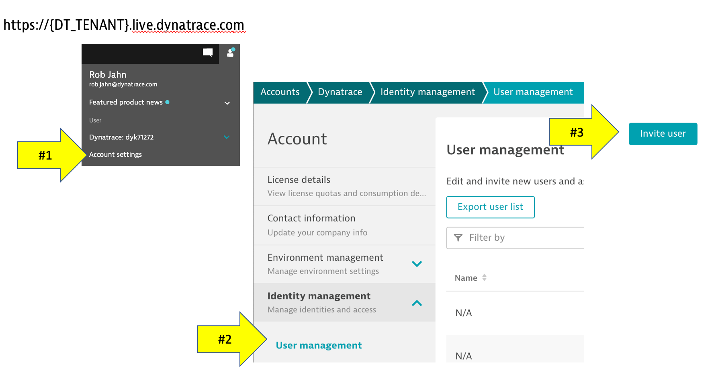
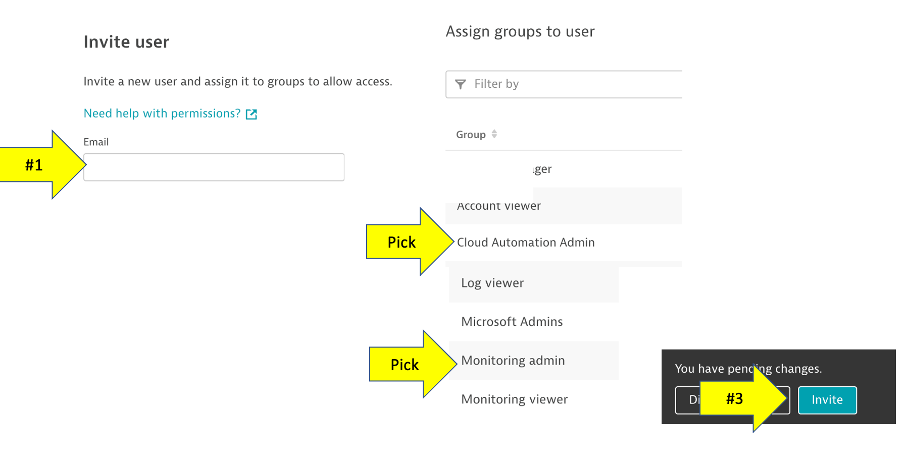

# User admin

When the Cloud Automation environment was provisioned, the requestor's email was setup with the `Cloud Automation Admin` role. This role allows this user to open the Cloud Automation web UI known as the Bridge.

# Invite more users

To invite a new user, follow these steps.

1. In Dynatrace goto `account settings` using the person icon on the top right
1. In the account settings menu, pick `User management`
1. Click the `Invite User` button

On the Invite User Page:

1. Enter email
1. Be sure to add the `Cloud Automation Admin` role.  Pick other roles, but you need `Monitoring Admin` to get into Dynatrace settings
1. Click the `Invite User` button

The new user will get an automated email to establish their password.  If that already have access to a Dynatrace environment within your account, they can get navigate to the the the Dynatrace or Cloud Automation URL. 

# Reference

Refer to the [Dynatrace Docs](https://www.dynatrace.com/support/help/how-to-use-dynatrace/user-management-and-sso/manage-groups-and-permissions) for more details.