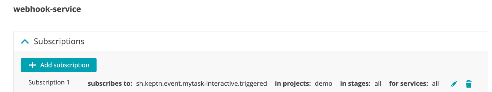
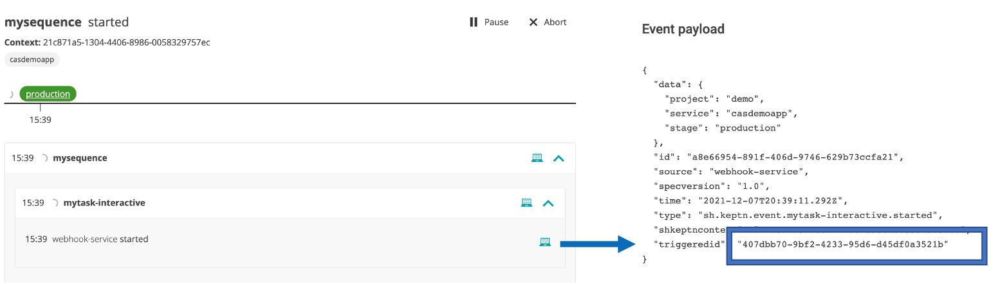
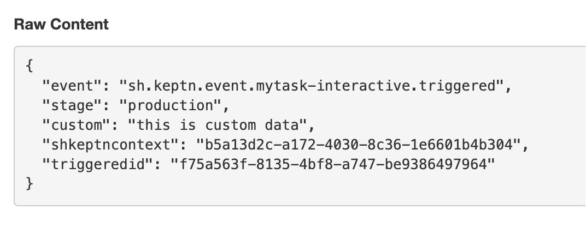
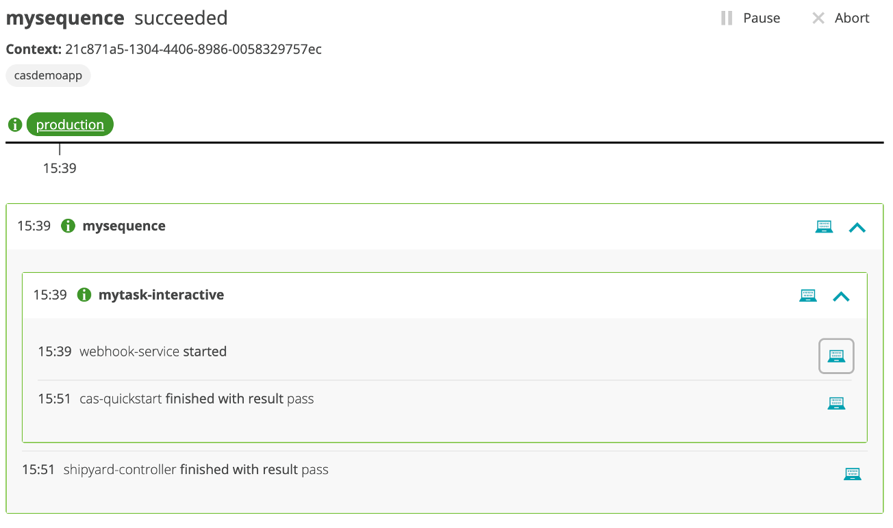

# Interactive webhook for a custom task  

For this use case you will simulate what a downstream system does by triggering a custom task and then manually sending back the `mytask-interactive.finished` event to Cloud Automation in order for the sequence to continue.  For this, you will need to capture and send back the `triggeredid` as to complete the processing. 

This custom task, `mytask-interactive`, does nothing but allows you to understand how to run the interactive model as to help you setup your custom integration.

## Step 1: Adjust the shipyard configuration in git

The UI enhancement is coming, but for now you need to manually adjust the `shipyard.yaml` to adjust the sequence tasks.

1. Open up the project in your git upstream repo and adjust the `shipyard.yaml` file in the `master` branch 

1. Add the `- name: "mytask-interactive"` task as the first task as shown below.  You can keep the `evaluation` task.

    ```
    apiVersion: spec.keptn.sh/0.2.2
    kind: "Shipyard"
    metadata:
      name: "demo-webhook"
    spec:
      stages:
        - name: "production"
          sequences:
          - name: "mysequence"
            tasks: 
            - name: "mytask-interactive"
            - name: "evaluation"
              properties:
                timeframe: "5m"
    ```

1. Commit your change

## Step 2: Configure the webhook

1. Click the `Add subscription` button

1. On the `New subscription` page, fill in the following values as shown below.
    * task = `mytask-interactive`
    * Task suffix = `triggered`
    * request method = `POST`
    * URL = the webbook.site URL you copied
    * custom payload below
        ```
        {
            "event": "{{.type}}",
            "stage": "{{.data.stage}}",
            "shkeptncontext": "{{.shkeptncontext}}",
            "id": "{{.id}}"
        }
        ```

1. Click the `Create subscription` button

## Step 3: Review

The new webhook should look like this



<!--
## Step 4: Adjust the webhook configuration in git

The UI enhancement is coming, but for now you need to manually adjust the `webhook.yaml` to tell Cloud Automation web service to wait for the custom task to send back finished status.  

1. Open up the project in your git upstream repo and adjust the `webhook/webhook.yaml` file in the `master` branch 

1. Find the `sh.keptn.event.mytask-interactive.triggered` entry and add the `sendFinished: false` row as shown below between `type` and `requests`

    ```
    apiVersion: webhookconfig.keptn.sh/v1alpha1
    kind: WebhookConfig
    metadata:3
      name: webhook-configuration
    spec:
      webhooks:
        - type: sh.keptn.event.mytask-interactive.triggered
          sendFinished: false
          requests:
            - curl --request POST --data
        ...
        ...
    ```

1. Commit your change

💥💥💥 **IMPORTANT NOTE** 💥💥💥

```
Once you edit the webhook file in GIT, you should not edit the webhook in the Web UI else the `sendFinished` setting will need to be manually re-added back.
```
-->

## Step 4: Trigger sequence

1. To trigger the sequence, from the SSH terminal run this command

    ```
    cd ~/cas-quickstart/scripts
    ./trigger.sh
    ```

1. This will prompt for a menu, choose option value of `1` as shown below.

    ```
    ===================================================================
    1) Send 'production.mysequence.triggered' event
    2) Send 'sh.keptn.event.mytask-interactive.finished' event
    -------------------------------------------------------------------
    q) quit and exit
    ===================================================================
    Pick the number for the event to trigger : 1

    Running 'keptn send event --file ./events/mysequence-triggered.json'
    OUTPUT = ID of Keptn context: 409d7b25-d04b-44f3-a636-d2fc8d67819a
    ```

1. Review the bridge pick the `demo` project and `sequence` menu to view the sequence in a started state.  If you expand the `mytask-interactive` of the sequence, you can see that the task events contain the unique `triggeredid` for the task as shown below. You will need this `triggeredid` later to finish the task. 

    

1.  Review the webhook.site to view the generated trigger event. It will look like this and is the result of the other webhook subscription that you created earlier.

    

    💥💥💥 **IMPORTANT NOTE** 💥💥💥

    ```
    The event you see in the webhook.site is what would be sent to any down stream tool.  So the payload that was send should be customized with the expected format and the data required to drive any logic.
    ```

## Step 5: Indicate the mytask-interactive is finished

Since you setup an interactive webhook, you must send back a `mytask-interactive.finished` event to indicate the task is finished. This event must include unique `triggeredid` shown earlier.

1. In the SSH terminal, run the `./trigger.sh` command again and pick option `2`

    ```
    ===================================================================
    1) Send 'production.mysequence.triggered' event
    2) Send 'sh.keptn.event.mytask-interactive.finished' event
    -------------------------------------------------------------------
    q) quit and exit
    ===================================================================
    Pick the number for the event to trigger : 2

    Running 'keptn send event --file ./events/mytask-interactive-finished.json'
    Enter triggeredid value :
    ```

1. At the `Enter triggeredid value` prompt, paste the `triggeredid` value taken from the `mytask-interactive.started` payload. If you expand the `mytask-interactive` of the sequence, you can see that the task events contain the unique `triggeredid` for the task as shown below. 

    

1. After you enter value, the output will look like this:

    ```
    Enter triggeredid value : 407dbb70-9bf2-4233-95d6-d45df0a3521b
    keptn send event output = ID of Keptn context: 21c871a5-1304-4406-8986-0058329757ec

    Goto the Cloud Automation Bridge and confirm the sequence has completed
    ```

1. Back in the bridge, review the sequence.  The `mytask-interactive` should be complete and the whole sequence should be complete too.

    

## Step 6: (OPTIONAL) Experiment with different status values

To see how different values of the `status` and `result` get displayed in the bridge, you can adjust the events file used by the `trigger.sh` script.  

To do this, use SSH terminal and navigate to the `scripts/events` subfolder.  Edit the `mytask-interactive-finished.template` file and rerun the scenario using the `trigger.sh` script.

As reference:
* `status` expresses the task execution itself, meaning could the keptn service execute the task. Valid values are: `succeeded`, `errored`, `unknown`
* `result` expresses is the result of the task being execution. Valid values are: `pass`, `warning`, `fail`

<hr>

[](SILENT.md) [](BUILDWEBHOOK.md)

