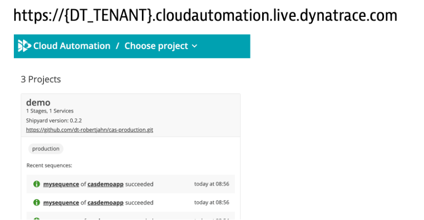
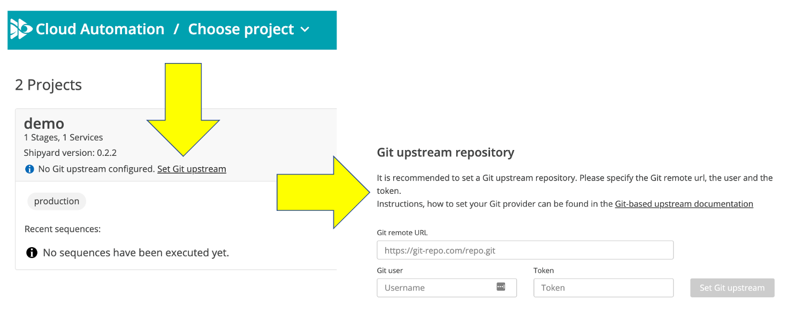

# Onboard sample application to Cloud Automation

The [keptn CLI](https://keptn.sh/docs/0.10.x/reference/cli/) is a command line utility that creates projects, onboarding services, and add new artifact events with CloudAutomation Keptn module. Once the Keptn CLI in downloaded and authenticated, then scripts that call the CLI will automated the onboarding of the demo app within Cloud Automation project. 

Once that is done, you will configure the demo project to connect to a new git repo that stores the project files and setup a Cloud Automation secret with your Dynatrace API token that will be used during SLO evaluations. 

## Step 1: Install and authenticate the Keptn CLI

In the SSH terminal, run these commands to install and authenticate the Keptn CLI

1. Download and install the Keptn CLI

    ```
    curl -sL https://get.keptn.sh | KEPTN_VERSION=0.10.0 sudo -E bash
    ```

1. Since you are not running Keptn in your own Kubernetes instance, run this command to suppress KEPTN CLI messages related to kubectl configuration 

    ```
    keptn set config KubeContextCheck false
    ```

1. Verify the Keptn CLI is installed. Run the `keptn version` command. You should see output similar to this:

    ```
    keptn version

    Keptn CLI version: 0.10.0
    Keptn cluster version: 0.10.0
    ```

## Step 2: Get Credential and Authenticate the CLI

1. Open Cloud Automation web UI.

    

1. Within your Cloud Automation web UI, click on the person icon on the top right to expand the `Get started` popup.  From the popup, use the `copy keptn auth command` button

    

1. In the SSH terminal, authenticate the Keptn CLI by pasting the copied `keptn auth` command from the previous step.  The command you will paste and the output should be similar to this:

    ```
    keptn auth --endpoint=https://[YOUR-URL]/api --api-token=[YOUR_TOKEN]

    Starting to authenticate
    Successfully authenticated against the Keptn cluster https://[YOUR-URL]/api
    ```

## Step 2: Create Keptn project within Cloud Automation

In the SSH terminal, run this command that will automate the process to add a project, service, and supporting project files.

```
cd ~/cas-quickstart/scripts
./create-keptn-projects.sh
```

1. From the Cloud Automation UI, verify that you have a `demo` project and a `casdemoapp` service within it. The configured project and service will look like this. 

   

## Step 4: Configure project upstream repo

Here you need to create a public git based repository where the Cloud Automation files will be installed.

💥💥💥 **IMPORTANT NOTE** 💥💥💥

```
You must do this in order to view and edit the Cloud Automation project files.
```

1. First setup your repo and access token per this [Repo Setup Documentation](https://keptn.sh/docs/0.10.x/manage/git_upstream/)

1. Once you have your repo and token, on the Cloud Automation Web UI, click on the URL to `Set the GIT upstream` repo as shown below:

    

1. Once the configuration is saved, then verify your repo has been updated.  It should look as shown below:

    

## Step 5: Configure project with Dynatrace integration

A Dynatrace API token is needed for by [Dynatrace service](https://github.com/keptn-contrib/dynatrace-service) to support SLO evaluations where Dynatrace is the data source. The configured secret must look like this. 


From the Cloud Automation UI, configure the Dynatrace secret by following these steps:

1. Click on the `demo` project
1. Choose the `Uniform` menu option on the left side and then the `secrets` page
1. Click `Add secret` button
    * Name MUST be `dynatrace`
    * Scope value of `dynatrace-secret`
    * Add two Key-value pairs with these names
        * `DT_TENANT` = your Dynatrace URL like "https://abcefg.live.dynatrace.com"
            * Make sure no `\` at the end
            * Make sure this is the Dynatrace URL and NOT the Cloud Automation URL
        * `DT_API_TOKEN` = Make sure this is the Dynatrace API token and NOT the Cloud Automation Token NOR the Dynatrace OneAgent installation token 

<hr>

[](APP.md) [](WEBHOOK.md)