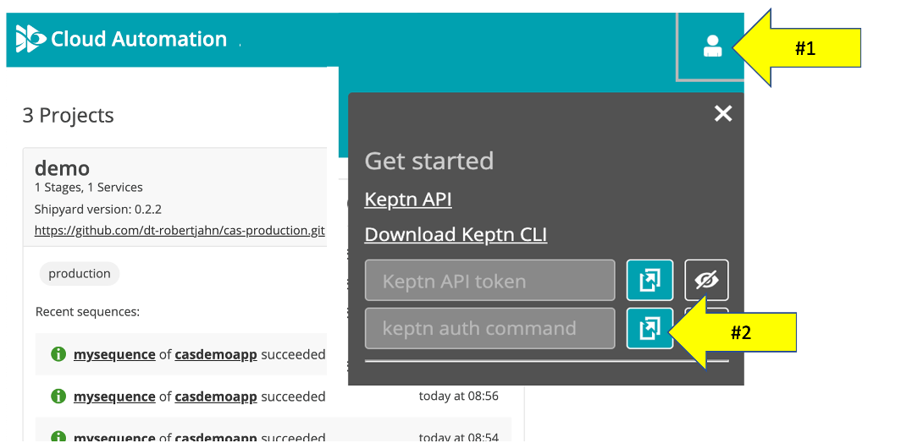
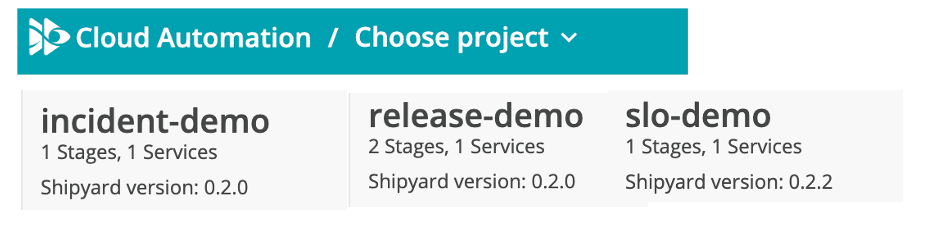
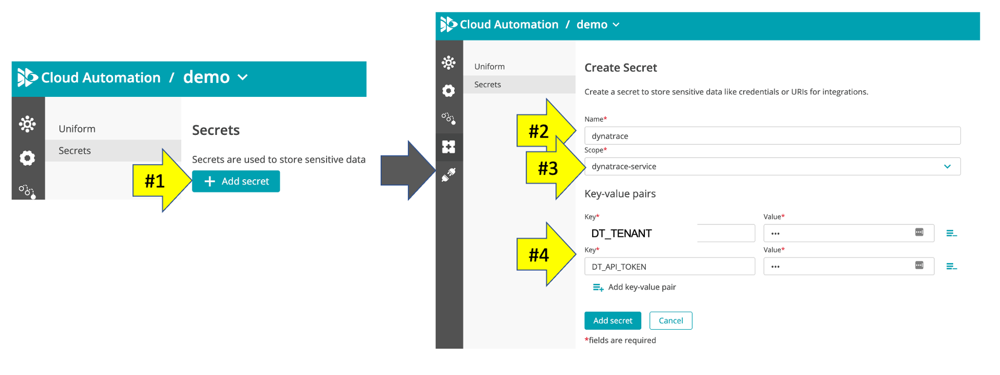

# Onboard sample application to Cloud Automation

Follow these steps to configure (a.k.a. onboard) the sample app services within Cloud Automation project. 

## Step 1: Install and authenticate the Keptn CLI

The [keptn CLI](https://keptn.sh/docs/0.10.x/reference/cli/) is a command line utility that creates projects, onboarding services, and add new artifact events with CloudAutomation Keptn module.

In the SSH terminal, run these commands to install and authenticate the Keptn CLI

1. Download and install the Keptn CLI

    ```
    curl -sL https://get.keptn.sh | KEPTN_VERSION=0.10.0 sudo -E bash
    ```

1. Since you are not running Keptn in your own Kubernetes instance, run this command to suppress KEPTN CLI messages related to kubectl configuration 

    ```
    keptn set config KubeContextCheck false
    ```

1. Verify the Keptn CLI is installed. Run the `keptn version` command. You should see output similar to this:

    ```
    keptn version

    Keptn CLI version: 0.10.0
    Keptn cluster version: 0.10.0
    ```

1. Within your Cloud Automation web UI, click on the person icon on the top right to expand the `Get started` popup.  From the popup, use the `copy keptn auth command` button

    

1. In the SSH terminal, authenticate the Keptn CLI by pasting the copied `keptn auth` command from the previous step.  You should see output similar to this:

    ```
    keptn auth --endpoint=https://[YOUR-URL]/api --api-token=[YOUR_TOKEN]

    Starting to authenticate
    Successfully authenticated against the Keptn cluster https://[YOUR-URL]/api
    ```

## Step 2: Create Keptn project within Cloud Automation

In the SSH terminal, run this command that will automate the process to add a project, service, and supporting project files.

```
cd ~/cas-quickstart/scripts
./create-keptn-projects.sh
```

1. From the Cloud Automation UI, verify that you have a `demo` project and a `casdemoapp` service within it. The configured project and service will look like this. 

   

## Step 4: Configure project upstream rep

On the new project, click on the URL to `Set the GIT upstream` repo. For this you will need to specify the Git remote url, the user and the token.  See below as reference.


## Step 5: Configure project with Dynatrace integration

An API token is needed for by Dynatrace service to support SLO evaluations where Dynatrace is the data source.

From the Cloud Automation UI, configure the Dynatrace URL and API token that you made earlier as a secret. The names MUST be as explained below.

1. click `Add secret` button
1. the name MUST be `dynatrace`
1. scope value of `dynatrace-secret`
1. Add two Key-value pairs with these names
    * `DT_TOKEN` = your Dynatrace URL like https://[YOUR-ENVIRONMENT-ID].sprint.dynatracelabs.com/"
    * `DT_API_TOKEN` = the Dynatrace token you made earlier

The configured secret will look like this. 



<hr>

[](SETUP.md) [](WEBHOOK.md)