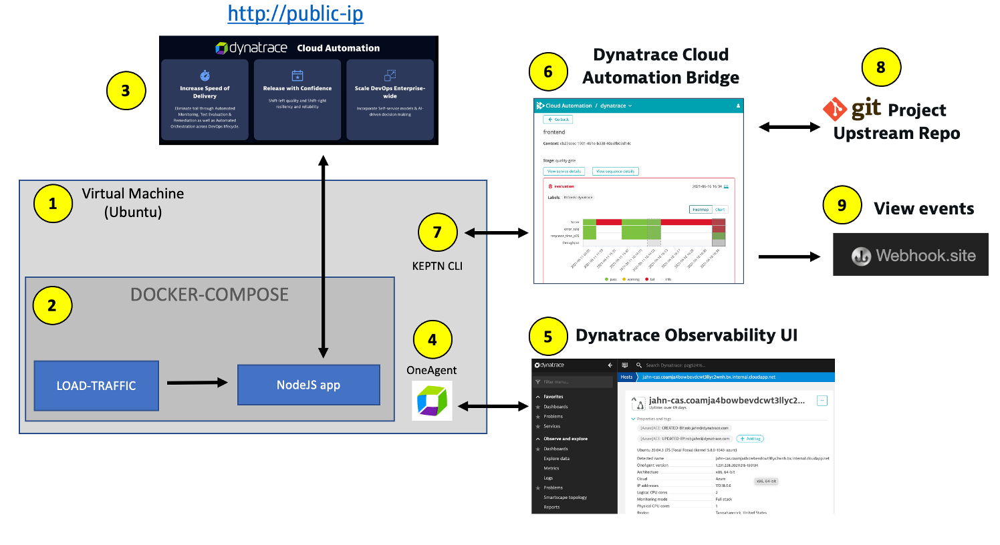

# Overview

This is a quick start guide for the Dynatrace Cloud Automation Solution (CAS).  

The guide shows how to setup a sample application and configure the Dynatrace problem notification webhook to send problem events to the Cloud Automation control plane. Once events are in the control plane, subscriptions to this event can be configured a downstream system.

The Quick start will setup an environment as follows:

1. Sample application web interface - viewable in a browser
1. Sample application - runs within a local Docker compose network.  There is a simple frontend and backend with an embedded database and service that sends web requests continuously
1. EC2 instance - hosts the sample app
1. Dynatrace OneAgent - monitor EC2 and the sample application
1. Dynatrace SaaS environment - web interface to view and configure Dynatrace
1. Cloud Automation web UI (a.k.a. Cloud Automation "bridge") - to view workflow execution and SLO results
1. Cloud Automation API web interface - allows for a quick way to execute the API from a web interface
1. Cloud Automation command line utility - allows creating projects, onboarding services, and sending new artifact events to CloudAutomation.

# Prerequisites

In order to provide early access to partners, Dynatrace will provision a “sprint” Dynatrace account and "sprint" environments.

1.  Within this account, Dynatrace will create:
    * Dynatrace instance with full admin rights. For example https://[YOUR-DT-ENVIRONMENT].sprint.dynatracelabs.com
    * Cloud Automation Solution instance. For example https://[YOUR-CAS-ENVIRONMENT].cloudautomation.sprint.dynatracelabs.com 
1. Partner manages team members access using Dynatrace account settings
1. Partner provides and manages a virtual machine with OneAgent and sample application. See Quick start guide below.

# Quick start guide

Follow the instructions for each step below in order.

1. [Setup Virtual Machine with the OneAgent and a sample application](SETUP.md)

1. [Onboard sample application to Cloud Automation](ONBOARD.md)

1. [Configure Cloud Automation Webhook subscription](WEBHOOK.md)

1. [Trigger a problem event using Cloud Automation API](PROBLEMEVENTTEST.md) 

1. [Trigger a problem event end-to-end from Dynatrace](PROBLEMEVENT.md) 

1. [Trigger a SLO evaluation using API](SLO.md)

# Support

For help or questions, email [Rob Jahn](https://www.linkedin.com/in/robjahn/) of the Dynatrace Technical Alliances team (based in Boston) @ rob.jahn@dynatrace.com 