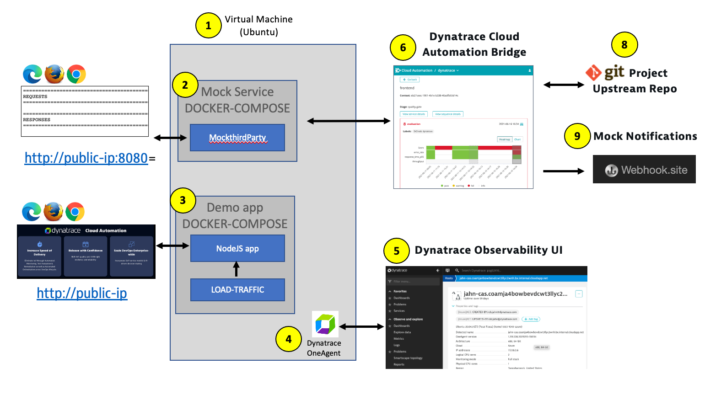

# Overview

[Dynatrace Cloud Automation](https://www.dynatrace.com/platform/cloud-automation/) powered by [Keptn](https://keptn.sh) can orchestrate different delivery or operational processes that are part of an application's lifecycle. 

Cloud Automation also provides an easy, event-based integration point for external tools (such as testing services, notification services, and incident management services) via webhooks. With external tool integration, you can set external tools to send events to Dynatrace, or set Dynatrace Cloud Automation to send events to external tools, which can then execute certain tasks in response.

The guide shows how to setup a sample application and configure webhooks to send events into the Cloud Automation control plane. Once events are in the control plane, subscriptions to this event can be configured a downstream system.

# Prerequisite Knowledge

Dynatrace
* Understanding of Dynatrace, OneAgent and the Software Intelligence Platform
* Understanding of Process Groups, Process Group Instances and Services
* Know how to navigate the Dynatrace web interface to find Services, Release Overview, Dashboards

Cloud Automation Module
* Understanding of Keptn and Cloud Automation architecture and design conceptss

# Dynatrace Accounts

In order to provide early access to webhooks, Dynatrace will provision a `sprint` Dynatrace account and `sprint` environments.

1.  Within this `sprint` account, Dynatrace will create:
    * Dynatrace SaaS environment
    * Cloud Automation Solution SaaS instance
1. You manage team members access using Dynatrace account settings. Cloud Automation uses the same SSO as Dynatrace, so you will use the same login for both.  This will also be the same SSO to your production Dynatrace trial or licensed environments.
1. You provide and manages a virtual machine with OneAgent and sample application. See Quick start guide below.

# Quick start environment

As you follow the Quick start, your environment will look as follows:

1. **Virtual Machine** - to host the sample app
1. **Sample application** - runs within a local Docker compose network. The application runs in a single container. A load generator container is also sending web requests continuously.  The Docker images have already been created and published to dockerhub
1. **Sample application web interface** - viewable in a browser
1. **Dynatrace OneAgent** - monitor host and the sample application
1. **Dynatrace SaaS** - web interface with full-stack observability
1. **Cloud Automation Control Plane (Powered by Keptn)** - Installed with a Dynatrace Keptn service that connects to the Dynatrace API
1. **Cloud Automation web UI (a.k.a. Cloud Automation "bridge")** - to view workflow execution and SLO results
1. **Keptn command line utility** - allows creating projects, onboarding services, and sending new artifact events to CloudAutomation.

# Quick start guide

Follow the instructions for each step below in order.

1. [Provision Virtual Machine with the OneAgent](VM.md)

1. [Setup Dynatrace monitoring configuration](SETUP.md)

1. [Start the sample application](APP.md)

1. [Onboard sample application to Cloud Automation](ONBOARD.md)

1. [Configure Cloud Automation Webhook subscription](WEBHOOK.md)

1. [Trigger a sequence](TRIGGER.md)

# Resources

### Documentation

* Dynatrace  - https://www.dynatrace.com/support/help/how-to-use-dynatrace/cloud-automation
* Keptn - https://keptn.sh 
* Keptn community - https://keptn.sh/community/ 	

### Support

* For help or questions, email [Rob Jahn](https://www.linkedin.com/in/robjahn/) of the Dynatrace Tech Alliances team @ rob.jahn@dynatrace.com 