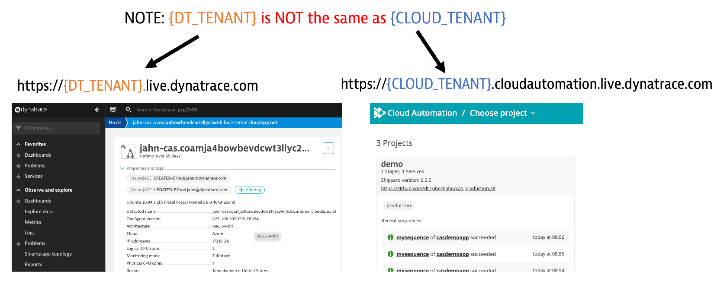

# Overview

The guide shows how to setup and use the [Dynatrace Cloud Automation](https://www.dynatrace.com/platform/cloud-automation/) that provides an easy, event-based integration platform for external tools such as testing services, notification services, and incident management services. 

The main goal of Dynatrace Cloud Automation is to enable Development, DevOps and SRE teams to build better quality software faster by bringing Observability, Orchestration, Automation, and Intelligence by:

* Breaking the dependency between process and tooling
* Using standards-based tool interoperability through Cloud Events and control plane
* Having data driven, declarative orchestration without the need to write pipeline code
* Supporting Declarative SLO and SLI specification based on SRE principles supporting and metric data source
* Using GitOps based delivery and operational workflows based on Git

This guide currently showcases webhook integrations, but the plan is to incorporate a Cloud Automation remote execution plane as to aide in the development and test of custom Cloud Automation services.

For help or questions, email [Rob Jahn](https://www.linkedin.com/in/robjahn/) of the Dynatrace Tech Alliances team @ rob.jahn@dynatrace.com 

# Prerequisite knowledge

### Dynatrace

* [Dynatrace Platform Overview](https://www.dynatrace.com/support/help/get-started/)
* [OneAgent](https://www.dynatrace.com/support/help/setup-and-configuration/dynatrace-oneagent)
* [Services](https://www.dynatrace.com/support/help/how-to-use-dynatrace/transactions-and-services)
* [Dynatrace web interface](https://www.dynatrace.com/support/help/get-started/navigation)

### Cloud Automation architecture and design concepts

* [Cloud Automation Overview Blog](https://www.dynatrace.com/news/blog/deliver-cloud-native-applications-faster-with-dynatrace-cloud-automation-module/)
* [Overview video](https://www.youtube.com/watch?v=H4tZhpKxVC4)

# Prerequisites

The following items comprise your environment

1. Dynatrace Accounts:
    * Dynatrace environment
    * Dynatrace Cloud Automation instance
1. Permissions:
    * You manage team members access using Dynatrace account settings. 
    * Cloud Automation uses the same SSO as Dynatrace, so you will use the same login for this  
1. Compute
    * You provide and manage a virtual machine that hosts the OneAgent and sample application. 
    * See the next section below for details

# Dynatrace UI versus Cloud Automation UI

There are two different web user interfaces that you need to have open for this guide.  Each has its own URL as shown below.
* On the left is the **Dynatrace SaaS** - Used for monitoring of the demo application
* On the right is the **Cloud Automation web UI (a.k.a. Cloud Automation "bridge")** - Used to view the Cloud Automation workflows, called sequences, and configuration of webhooks

# Demo Environment

Refer to the picture below for the components that make up this guide.

1. **Virtual Machine** - hosts the demo app, OneAgent, and Keptn CLI 
1. **Sample application** - runs within a local Docker compose network. The application runs in a single container. A load generator container is also sending web requests continuously.  The Docker images have already been created and published to Dockerhub
1. **Sample application web interface** - viewable in a browser
1. **Dynatrace OneAgent** - monitor host and the sample application
1. **Dynatrace** - web interface with full-stack observability
1. **Dynatrace Cloud Automation web UI** - Used to view the Cloud Automation workflows called sequences and configuration of webhooks
1. **Command line utility** - allows creating projects, onboarding services, and sending new artifact events to CloudAutomation.
1. **Upstream Repo** - stores all the configuration files for the Cloud Automation demo application
1. **webook.site** - used to quickly see the events that would be send to a downstream tool

# Quick start guide

Follow the instructions for each step below in order.

## 1. Environment Setup

* [Provision Virtual Machine with the OneAgent](VM.md)
* [Setup Dynatrace monitoring configuration](SETUP.md)
* [Start the sample application](APP.md)
* [Onboard sample application to Cloud Automation](ONBOARD.md)

## 2. Try out the quick start use cases

* [Webhooks](WEBHOOK.md)

## 3. Build your own integration

* [Webhooks](BUILDWEBHOOK.md)

# Resources

## Dynatrace Cloud Automation

* [Dynatrace Docs](https://www.dynatrace.com/support/help/how-to-use-dynatrace/cloud-automation)
* [Release Notes](https://www.dynatrace.com/support/help/shortlink/release-notes#cloud-automation)

## Keptn

* [Keptn Website](https://keptn.sh)
* [Keptn Dynatrace Service](https://github.com/keptn-contrib/dynatrace-service)
* [Keptn community](https://keptn.sh/community)
* [Keptn Release Notes](https://github.com/keptn/keptn/releases)

