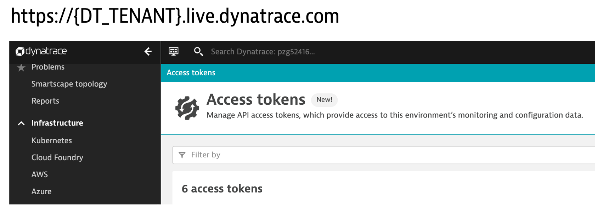

# Setup Dynatrace monitoring configuration

Follow these steps to automate the setup the Dynatrace monitoring configuration

## Step 1: Add Dynatrace API token

A Dynatrace API token is needed for by Dynatrace service to support SLO evaluations where Dynatrace is the data source. To add your token:

1. Open the Dynatrace web UI and within Dynatrace, using the left side menu click on `Manage --> Access tokens`.

    
 
1. Click `Generate new token` button
1. Copy these names into the `filter` box and select it to add to the scope.  Repeat for all scopes below:
    * API V1
        * Access problem and event feed, metrics, and topology
        * Create and read synthetic monitors, locations, and nodes
        * Read configuration
        * Write configuration
        * Capture request data
        * Data ingest, e.g.: metrics and events
    * API V2
        * Ingest events
        * Read metrics
        * Ingest metrics
        * Read entities
        * Read problems
        * Write problems
1. Click Generate Token

    💥💥💥 **IMPORTANT NOTE** 💥💥💥

    ```
    Save your token to a safe place, for you only get to see it once and you need it later during the setup.
    ```

## Step 2: Download and install monaco

This setup of the Dynatrace configuration uses the [Dynatrace Monitoring as Code](https://dynatrace-oss.github.io/dynatrace-monitoring-as-code/) (Monaco) utility.  To download and install:

1. In the SSH terminal, run these commands to download and install the monaco binary. 

    ```
    cd ~
    curl -L https://github.com/dynatrace-oss/dynatrace-monitoring-as-code/releases/download/v1.6.0/monaco-linux-amd64 -o monaco
    chmod +x monaco
    sudo mv ~/monaco /usr/local/bin/
    ```

1. Verify the monaco binary, by running this command. The output should display 1.6.0

    ```
    monaco --version
    ```
1. Clone this repo to the home directory

    ```
    cd ~
    git clone https://github.com/robertjahn/cas-quickstart
    ```

## Step 3: Call the script to add Dynatrace Monitoring configuration

A custom script called `setup-dynatrace-config.sh` is used to call both monaco and the Dynatrace API to configure your environment.  This script requires your Dynatrace URL and API token, so you need to put those into a `credentials.json` file.  

1. Copy the `credentials.template` to `credentials.json` file.  

    ```
    cd ~/cas-quickstart/scripts
    cp credentials.template credentials.json
    ```

1. Edit `credentials.json` with your Dynatrace URL and API token you just created

1. Lastly, run the Dynatrace configuration script. 

    **BUT** for this you need to provide a dashboard owner email as a required argument. This must be a valid Dynatrace user's email as shown below.

    ```
    cd ~/cas-quickstart/scripts
    ./setup-dynatrace-config.sh your-email@company.com
    ```

    Output should look like:

    ```
    -----------------------------------------------------------------------------------
    Setting up Dynatrace config
    Dynatrace  : https://abcefg.live.dynatrace.com
    Starting   : Mon Nov  8 13:48:47 EST 2021
    -----------------------------------------------------------------------------------
    Running monaco for project = setup
    ...
    ...
    -----------------------------------------------------------------------------------
    Done Setting up Dynatrace config
    End: Mon Nov  8 13:48:48 EST 2021
    -----------------------------------------------------------------------------------
    ```

    The script adds the following Dynatrace configuration:
    * Set global [Frequent Issue Detection](https://www.dynatrace.com/support/help/how-to-use-dynatrace/problem-detection-and-analysis/problem-detection/detection-of-frequent-issues/) settings to Off to make testing of problems easier
    * Adjust the [Service Anomaly Detection](https://www.dynatrace.com/support/help/how-to-use-dynatrace/problem-detection-and-analysis/problem-detection/adjust-sensitivity-anomaly-detection/) to make testing of problems easier
    * Add [Auto Tagging Rules](https://www.dynatrace.com/support/help/how-to-use-dynatrace/tags-and-metadata/) to drive service tags for the demo application
    * Add a custom [dashboard](https://www.dynatrace.com/support/help/how-to-use-dynatrace/dashboards-and-charts/) that will be used during SLO automated evaluation

## Step 4: Verify Dynatrace Configuration

For a quick confirmation, verify the custom SLO dashboard was added.

1. Using the left side menu click on `Observe and explore --> Dashboards`.
1. Open the one called: `KQG;project=demo;stage=production;service=casdemoapp`.  It should look like this:
    

<hr>

[](VM.md) [](APP.md)