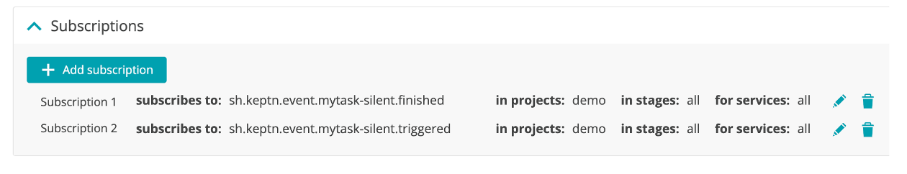

#  Silent webhook for a custom task 

For this use case you will simulate what a downstream system does by triggering a custom task and having that task automatically send back the `mytask-silent.finished` event to Cloud Automation in order for the sequence to continue.  

This custom task, `mytask-silent`, does nothing but allows you to understand how to run the silent model as to help you setup your custom integration.

## Step 1: Adjust the shipyard configuration in git

The UI enhancement is coming, but for now you need to manually adjust the `shipyard.yaml` to adjust the sequence tasks.

1. Open up the project in your git upstream repo and adjust the `shipyard.yaml` file in the `master` branch 

1. Add the `- name: "mytask-silent"` task as shown below. You can keep the `evaluation` task.

    ```
    apiVersion: spec.keptn.sh/0.2.2
    kind: "Shipyard"
    metadata:
      name: "demo-webhook"
    spec:
      stages:
        - name: "production"
          sequences:
          - name: "mysequence"
            tasks: 
            - name: "mytask-silent"
            - name: "evaluation"
              properties:
                timeframe: "5m"
    ```

1. Commit your change

## Step 2: Configure the webhook on the `triggered` event

1. From the Cloud Automation UI, click on the project `demo`

1. On the left menu click on the `Uniform` option

1. Click on the `webhook-service` service

1. Click the `Add subscription` button

1. On the `New subscription` page, fill in the following values as shown below.
    * task = `mytask-silent`
    * Task suffix = `triggered`
    * request method = `POST`
    * URL = the wehbook.site URL you copied
    * custom payload below
        ```
        {
            "event": "{{.type}}",
            "stage": "{{.data.stage}}",
            "custom": "{{.data.custom}}",
            "shkeptncontext": "{{.shkeptncontext}}",
            "id": "{{.id}}"
        }
        ```

1. Click the `Create subscription` button

## Step 3: Configure the webhook on the `finished` event

1. From the Cloud Automation UI, click on the project `demo`

1. On the left menu click on the `Uniform` option

1. Click on the `webhook-service` service

1. Click the `Add subscription` button

1. On the `New subscription` page, fill in the following values as shown below.
    * task = `mytask-silent`
    * Task suffix = `finished`
    * request method = `POST`
    * URL = the wehbook.site URL you copied
    * custom payload below
        ```
        {
            "event": "{{.type}}",
            "stage": "{{.data.stage}}",
            "custom": "{{.data.custom}}",
            "shkeptncontext": "{{.shkeptncontext}}",
            "id": "{{.id}}"
        }
        ```

1. Click the `Create subscription` button

## Step 4: Review

The webhooks should look like this



## Step 5: Adjust the webhook configuration in git

The UI enhancement is coming, but for now you need to manually adjust the webhook.yaml simulate the task being run.  This will allow the task to start and finish automatically.

1. Open up the project in your git upstream repo and adjust the `webhook/webhook.yaml` file in the `master` branch 

1. Find the `sh.keptn.event.mytask-silent.triggered` entry and add the `sendFinished: true` row as shown below between `type` and `requests`.

    ```
    apiVersion: webhookconfig.keptn.sh/v1alpha1
    kind: WebhookConfig
    metadata:3
      name: webhook-configuration
    spec:
      webhooks:
        - type: sh.keptn.event.mytask-silent.triggered
          sendFinished: true
          requests:
            - curl --request POST --data
        ...
        ...
    ```
    
1. Commit your change

💥💥💥 **IMPORTANT NOTE** 💥💥💥

```
Once you edit the webhook file in GIT, you should not edit the webhook in the Web UI else the `sendFinished` setting will need to be manually re-added back.
```

## Step 6: Trigger sequence

1. To trigger the sequence, from the SSH terminal run this command

    ```
    cd ~/cas-quickstart/scripts
    ./trigger.sh
    ```

1. This will prompt for a menu, choose option value of `1` as shown below.

    ```
    ===================================================================
    1) Send 'production.mysequence.triggered' event
    2) Send 'sh.keptn.event.mytask-interactive.finished' event
    -------------------------------------------------------------------
    q) quit and exit
    ===================================================================
    Pick the number for the event to trigger : 1

    Running 'keptn send event --file ./events/mysequence-triggered.json'
    OUTPUT = ID of Keptn context: 409d7b25-d04b-44f3-a636-d2fc8d67819a
    ```

## Step 7: Review the sequence

Monitor the sequence progress in the Cloud Automation UI.  You should see the sequence call the custom `mytask-silent` and builtin `evaluation` tasks and the sequence being completed.  

If the SLO evaluation because of a low calculated score goes not pass (as shown below), that OK.  You can also go back and edit the `shipyard.yaml` to and remove the `evaluation` task and re-trigger the sequence to run again.


## Step 8: Review Webhook.site

In the webhook.site to view the generated events.  You should see the following events:
* `mytask-silent.triggered`
* `mytask-silent.finished`
* `evaluation.finished`

<hr>

[](SLO.md) [](INTERACTIVE.md)