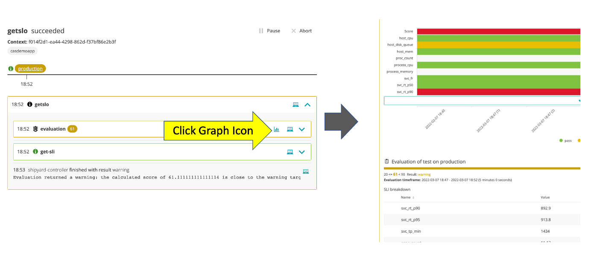
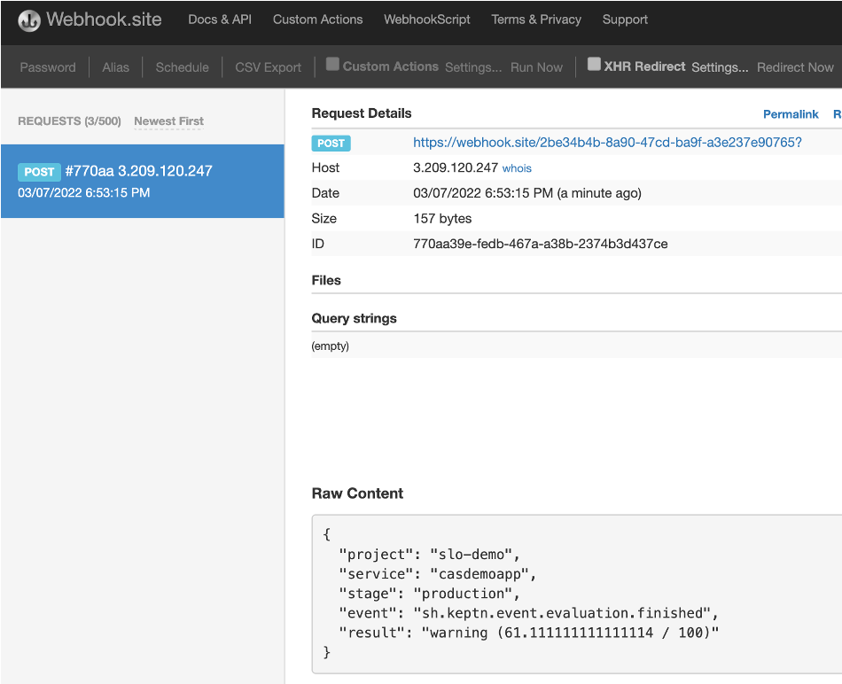

# Webhook using silent mode activation of the builtin SLO evaluation task

For this use case you will start with the builtin task called `evaluation` that performs an automated SLO evaluation. Your webhook will subscribe to the `evaluation.finished` event as to get the results.

As part of the setup, a Dynatrace dashboard was added that you can use to try out the Automated SLO evaluation.  This is one of features that has been first adopted by out Cloud Automation customers.  Typically use cases are to run a SLO evaluation after a deployment, configuration change, test or an automated problem remediation.

Read more about the benefits in this [Dynatrace Blog](https://www.dynatrace.com/news/blog/automating-slos-helps-sres-go-fast)

## Step 1: Review SLO Dashboard

To try it out, lets first review the configuration by going to your Dynatrace environment, choosing `Dashboards` from the left menu, and opening up the one with the name of `KQG;project=demo;stage=production;service=casdemoapp`. It should look like this:


## Step 2: Review shipyard file with the evaluation task

Navigate to you GIT project and open up the `shipyard.yaml` file in the root folder and then just add a `evaluation` task as shown below and commit the change to your GIT repo.

```
apiVersion: spec.keptn.sh/0.2.2
kind: "Shipyard"
metadata:
  name: "demo-webhook"
spec:
  stages:
    - name: "production"
      sequences:
      - name: "mysequence"
        tasks: 
        - name: "evaluation"
          properties:
            timeframe: "5m"
```

Cloud Automation has a built-in task called `evaluation` that will perform the SLO evaluation by sending an `evaluation.triggered` event that the builtin [Dynatrace Service](https://github.com/keptn-contrib/dynatrace-service) is listening for.   

For now, don't worry about the details you are just going to trigger the sequence to see it execute.

## Step 3: Configure the webhook

1. From the Cloud Automation UI, click on the project `demo`

1. On the left menu click on the `Uniform` option

1. Click on the `webhook-service`

1. Click the `Add subscription` button

1. On the `New subscription` page, fill in the following values as shown below.
    * task = `evaluation`
    * Task suffix = `finished`
    * request method = `POST`
    * URL = the wehbook.site URL you copied
    * custom payload below
        ```
        {
            "event": "{{.type}}",
            "stage": "{{.data.stage}}",
            "result": "{{.data.result}} ({{.data.evaluation.score}} / 100)"
        }
        ```

1. Click the `Create subscription` button

## Step 4: Review

The webhooks should look like this


## Step 5: Trigger sequence

1. To trigger the sequence, from the SSH terminal run this command

    ```
    cd ~/cas-quickstart/scripts
    ./trigger.sh
    ```

1. This will prompt for a menu, choose option value of `1` as shown below.

    ```
    ===================================================================
    1) Send 'production.mysequence.triggered' event
    2) Send 'sh.keptn.event.mytask-interactive.finished' event
    -------------------------------------------------------------------
    q) quit and exit
    ===================================================================
    Pick the number for the event to trigger : 1

    Running 'keptn send event --file ./events/mysequence-triggered.json'
    OUTPUT = ID of Keptn context: 409d7b25-d04b-44f3-a636-d2fc8d67819a
    ```

## Step 6: Review SLO evaluation

Monitor the sequence progress in the Cloud Automation UI.  Once the sequence is complete, you can click on the icon within the sequence to open up the results page.  If the SLO evaluation because of a low calculated score goes not pass (as shown below), that OK.  



## Step 7: Review Webhook.site

In the webhook.site to view the generated finished event.



## More details on the SLO evaluation

The SLO evaluation was performed by the [Cloud Automation Dynatrace service](https://github.com/keptn-contrib/dynatrace-service) that is installed as part of the Cloud Automation environment.  You can view the running version on the uniform page as shown below.


SLI data can be retrieved in a few different ways and if you look in the `scripts/create-keptn-project.sh` file you will see command that added the `dynatrace.conf.yaml` to the demo app project with the query from a Dynatrace dashboard option.  

See this [Dynatrace service README page](https://github.com/keptn-contrib/dynatrace-service/blob/master/documentation/slis-via-files.md) for SLI setup options and this [Dynatrace service README page](https://github.com/keptn-contrib/dynatrace-service/blob/master/documentation/slis-via-dashboard.md) for dashboard setup and how you can adjust the dashboard with different SLO targets.

You can read more too on the Quality Gate page within the [Keptn docs](https://keptn.sh/docs/0.10.x/quality_gates/get_started)

<hr>

[](WEBHOOK.md) [](SILENT.md)
