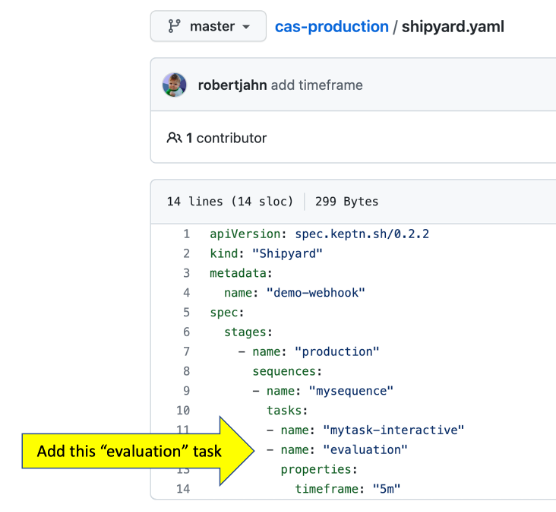

# Automated SLO evaluation

As part of the setup, a Dynatrace dashboard was added that you can use to try out the Automated SLO evaluation.  This is one of features that has been first adopted by out Cloud Automation customers.  Typically use cases are to run a SLO evaluation after a deployment, configuration change, test or an automated problem remediation.

Read more about the benefits in this [Dynatrace Blog](https://www.dynatrace.com/news/blog/automating-slos-helps-sres-go-fast)

To try it out, lets first review the configuration by going to your Dynatrace environment, choosing `Dashboards` from the left menu, and opening up the one with the name of `KQG;project=demo;stage=production;service=casdemoapp`.  

It should look like this on on left side of the picture below.  Once the evaluation is triggered, a sequence will start with the results showing on the SLO pages.

## Step 1: Add evaluation task to example sequence

Cloud Automation has a built-in task called `evaluation` that will perform the SLO evaluation.  To enable this, navigate to you GIT project and open up the `shipyard.yaml` file in the root folder and then just add a `evaluation` task as shown below and commit the change to your GIT repo.

## Step 2: Trigger sequence

To run an SLO evaluation, from the SSH shell rerun `./trigger.sh` to trigger the `mysequence.triggered` event. 

Once the sequence has started, you will need copy the `triggeredid` from the Cloud automation bridge.  Then choose the `triggered.sh` script option to send the `mytask.finished` event with this `triggeredid` in order for the sequence to move the `evaluation` task and to complete the sequence. 

*NOTE: You can refer the [TRIGGER guide page](TRIGGER.md) if you need a refresher on these steps.*

## Step 3: Review SLO evaluation

Once the sequence is complete, you can click on the icon within the sequence to open up the results page as shown below.

# More details on the SLO evaluation

The SLO evaluation was performed by the [Cloud Automation Dynatrace service](https://github.com/keptn-contrib/dynatrace-service) that is installed as part of the Cloud Automation environment.  You can view the running version on the uniform page as shown below.

SLI data can be retrieved in a few different ways and if you look in the `scripts/create-keptn-project.sh` file you will see command that added the `dynatrace.conf.yaml` to the demo app project with the query from a Dynatrace dashboard option.  

See this [README](https://github.com/keptn-contrib/dynatrace-service/blob/master/documentation/sli-configuration/configuration-of-dashboard-sli-slo-queries.md) for more details on this file and dashboard query option AND how you can adjust the dashboard with different SLO targets.

You can read more too on the Quality Gate page within the [Keptn docs](https://keptn.sh/docs/0.10.x/quality_gates/get_started)

 