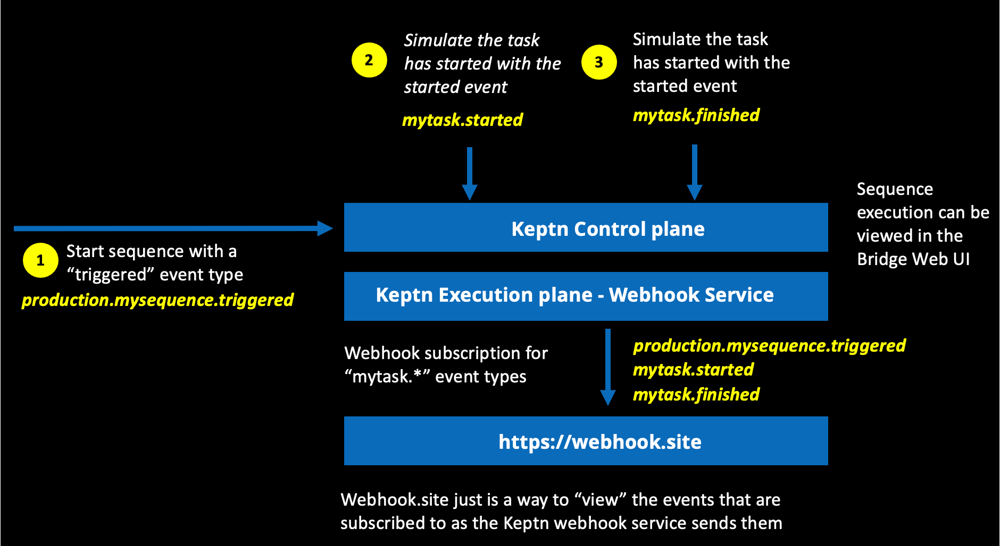
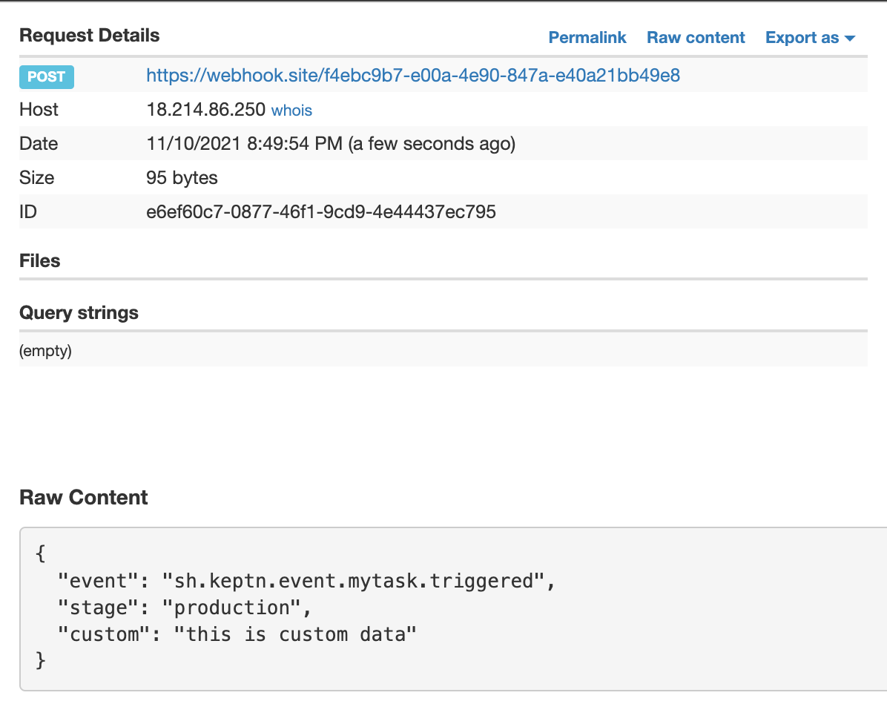

# Trigger a sequence

The picture below depicts the flow you will perform in this step.


To make is easy to perform this flow, a script called `trigger.sh` will send in the various Keptn events as shown in the picture below.



## Step 1: Start sequence with a “triggered” event type

1. In the SSH terminal, run this command

    ```
    cd ~/cas-quickstart/scripts
    ./trigger.sh
    ```

1. This will prompt for a menu, choose option value of `1` as shown below.

    ```
    ===================================================================
    1) production.mysequence.triggered
    2) sh.keptn.event.mytask.started
    3) sh.keptn.event.mytask.finished
    ===================================================================
    Pick the number for the event to trigger : 1

    Running 'keptn send event --file ./events/mysequence-triggered.json'
    OUTPUT = ID of Keptn context: 409d7b25-d04b-44f3-a636-d2fc8d67819a
    ```

1. Review the bridge pick the `demo` project and `sequence` menu to view the sequence in a started state.

1. Review the webhook.site to view the generated event. It will look like this

    

## Step 2: Simulate the task has started with the started event

1. In the SSH terminal, run the `./trigger.sh` command again and pick options `2`

    ```
    Pick the number for the event to trigger : 2

    Running 'keptn send event --file ./events/mytask-started.json'
    OUTPUT = ID of Keptn context: 409d7b25-d04b-44f3-a636-d2fc8d67819a
    ```

1. Review the bridge pick the `demo` project and `sequence` menu to view the sequence, but not yes started.

1. Review the webhook.site to view the generated event

## Step 3: Simulate the task has started with the started event

1. In the SSH terminal, run the `./trigger.sh` command again and pick options `3    `

    ```
    Pick the number for the event to trigger : 3

    Running 'keptn send event --file ./events/mytask-started.json'
    OUTPUT = ID of Keptn context: 409d7b25-d04b-44f3-a636-d2fc8d67819a
    ```

1. Review the bridge pick the `demo` project and `sequence` menu to view the sequence in a finished state.

1. Review the webhook.site to view the generated event

<hr>

[](WEBHOOK.md) [](README.md)