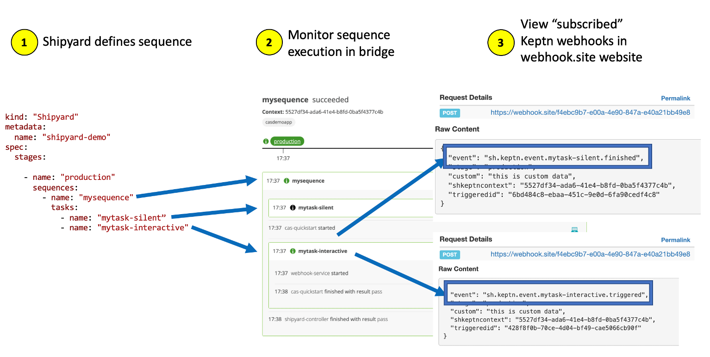
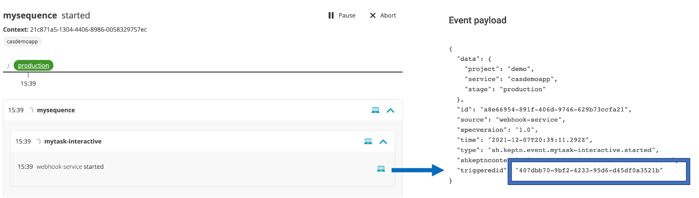
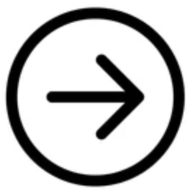

# Trigger a sequence

The picture below depicts the sequence tasks you will perform in this section.  



To make is easy to perform this flow, a script called `trigger.sh` will send in the various Keptn events.

## Step 1: Start sequence with a `production.mysequence.triggered` event type

1. In the SSH terminal, run this command

    ```
    cd ~/cas-quickstart/scripts
    ./trigger.sh
    ```

1. This will prompt for a menu, choose option value of `1` as shown below.

    ```
    ===================================================================
    1) production.mysequence.triggered
    2) sh.keptn.event.mytask-silent.started
    3) sh.keptn.event.mytask-silent.finished
    4) sh.keptn.event.mytask-interactive.finished
    ===================================================================
    Pick the number for the event to trigger : 1

    Running 'keptn send event --file ./events/mysequence-triggered.json'
    OUTPUT = ID of Keptn context: 409d7b25-d04b-44f3-a636-d2fc8d67819a
    ```

1. Review the bridge pick the `demo` project and `sequence` menu to view the sequence in a started state.

    

## Step 2: Simulate the `mytask-silent.started` and `mytask-silent.finished` events

1. In the SSH terminal, run the `./trigger.sh` command again and pick options `2`

    ```
    Pick the number for the event to trigger : 2

    Running 'keptn send event --file ./events/mytask-silent-started.json'
    OUTPUT = ID of Keptn context: 409d7b25-d04b-44f3-a636-d2fc8d67819a
    ```

1. In the SSH terminal, run the `./trigger.sh` command again and pick options `3`

    ```
    Pick the number for the event to trigger : 3

    Running 'keptn send event --file ./events/mytask-silent-finished.json'
    OUTPUT = ID of Keptn context: 409d7b25-d04b-44f3-a636-d2fc8d67819a
    ```

1. Review the bridge pick the `demo` project and `sequence` menu to view the sequence.  The `mytask-silent` should be complete and the `mytask-interactive` is now triggered since that was the next task in the shipyard file.

    

1. Review the webhook.site to view the generated finished event. It will look like this and is the result of the Keptn webhook that you created earlier.

    

## Step 3: Simulate the `mytask-interactive.finished` event

1. Review the webhook.site to view the generated trigger event. It will look like this and is the result of the other Keptn webhook that you created earlier.

    

1. In the Keptn sequence, click on the computer icon and copy the value for the `triggeredid` attribute as shown below.  You will need this to pass in the next step. 

    


1. In the SSH terminal, run the `./trigger.sh` command again and pick options `4`.  At the `Enter TRIGGER_ID` prompt, paste in the `triggeredid` value from the previous step.

    ```
    Pick the number for the event to trigger : 4

    Running 'keptn send event --file ./events/mytask-interactive-finished.json'
    Enter TRIGGER_ID : f75a563f-8135-4bf8-a747-be9386497964
    OUTPUT = ID of Keptn context: b5a13d2c-a172-4030-8c36-1e6601b4b304
    ```

1. Review the bridge pick the `demo` project and `sequence` menu to view the sequence in a finished state.

    

## Step 4: So what did we do?

Now that you ran the sequence, here are a pictures to help explain what was happening.


## Step 5: Experiment with different status values

In this project within the `events` subfolder, there are files with a `.template` extension.  So simply adjust a template file and rerun the scenario using the `trigger.sh` script.
* You can edit the values of the `status` and `result` attributes to simulate different sequence results.  
* The template files are used as the source when the `trigger.sh` is called.   
* NOTE: the files with a `.json` extension are generated by the `trigger.sh`, so don't edit those ones.

As reference:
* `status` expresses the task execution itself, meaning could the keptn service execute the task. Valid values are: `succeeded`, `errored`, `unknown`
* `result` expresses is the result of the task being execution. Valid values are: `pass`, `warning`, `fail`
* For example, a test task was called and it did run, so the `status = succeeded` but, the test being run failed so `result=fail`. 

<hr>

[](WEBHOOK.md) [](README.md)