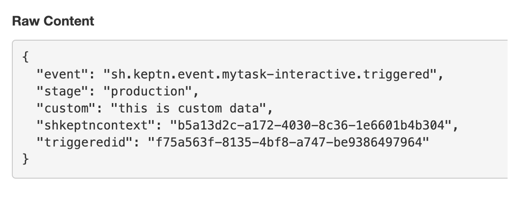
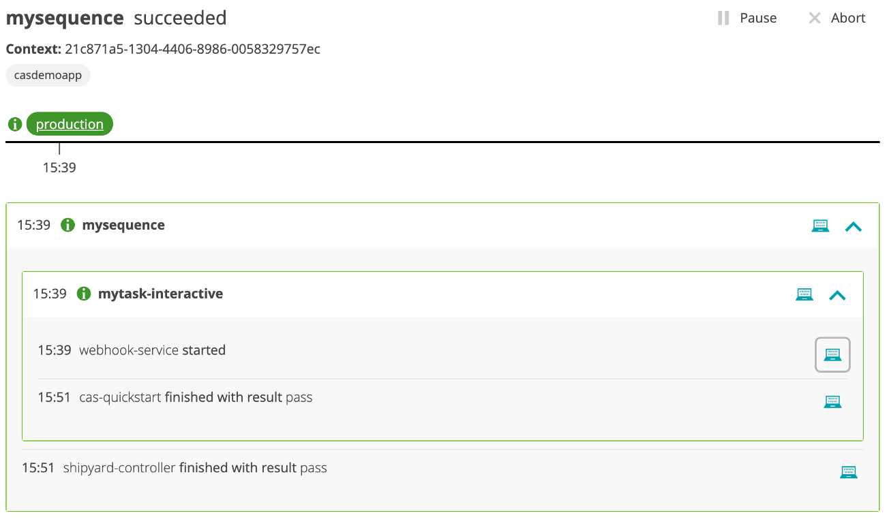

# Trigger a sequence and events

To make is easy to trigger the sequence and update tasks in the sequence, a script called `trigger.sh` will send in the various Cloud Automation events using event templates found in the `scripts/events` subfolder.

## Step 1: Start sequence

Sending in the `production.mysequence.triggered` event is how you start the sequence workflow.  A sequence will then automatically trigger the defined tasks within the sequence.  

1. In the SSH terminal, run this command

    ```
    cd ~/cas-quickstart/scripts
    ./trigger.sh
    ```

1. This will prompt for a menu, choose option value of `1` as shown below.

    ```
    ===================================================================
    1) Send 'production.mysequence.triggered' event
    2) Send 'sh.keptn.event.mytask-interactive.finished' event
    -------------------------------------------------------------------
    q) quit and exit
    ===================================================================
    Pick the number for the event to trigger : 1

    Running 'keptn send event --file ./events/mysequence-triggered.json'
    OUTPUT = ID of Keptn context: 409d7b25-d04b-44f3-a636-d2fc8d67819a
    ```

1. Review the bridge pick the `demo` project and `sequence` menu to view the sequence in a started state.  If you expand the `mytask` of the sequence you can see that the webservice started and the events contain the unique `triggeredid` for the task as shown below. 

    

1.  Review the webhook.site to view the generated trigger event. It will look like this and is the result of the other webhook subscription that you created earlier.

    

    💥💥💥 **IMPORTANT NOTE** 💥💥💥

    The event you see in the webhook.site is what would be sent to any down stream tool.  So the payload that was send should be customized with the expected format and the data required to drive any logic.

## Step 2: Indicate the task is finished

Since you setup an interactive webhook, you must send back a `mytask-interactive.finished` event to indicate the task is finished and pass back the unique trigger id.

1. In the SSH terminal, run the `./trigger.sh` command again and pick options `2`

    ```
    ===================================================================
    1) Send 'production.mysequence.triggered' event
    2) Send 'sh.keptn.event.mytask-interactive.finished' event
    -------------------------------------------------------------------
    q) quit and exit
    ===================================================================
    Pick the number for the event to trigger : 2

    Running 'keptn send event --file ./events/mytask-interactive-finished.json'
    Enter triggeredid value :
    ```

1. At the `Enter triggeredid value` prompt paste the `triggeredid` value taken from the `mytask` payload. Refer to the picture above for where to get this.  After you enter value, the output will look like this:

    ```
    Enter triggeredid value : 407dbb70-9bf2-4233-95d6-d45df0a3521b
    keptn send event output = ID of Keptn context: 21c871a5-1304-4406-8986-0058329757ec

    Goto the Cloud Automation Bridge and confirm the sequence has completed
    ```

1. Back in the bridge, review the sequence.  The `mytask-interactive` should be complete and the whole sequence should be complete too since there was only one task.

    


    💥💥💥 **IMPORTANT NOTE** 💥💥💥

    What was done by this `trigger.sh` script would need to be done in the logic of the down stream tool.  That is, parse out the `triggeredid` and `keptncontextid` and call the Cloud Automation API to send back in the `finished` event.

## Step 3: Review the `mytask-interactive.finished` event

In the webhook.site to view the generated finished event. It will look like this and is the result of the webhook subscription that you created earlier.


💥💥💥 **IMPORTANT NOTE** 💥💥💥

The event see in the webhook.site is what would be send to any down stream tool.  So the payload that was send should be customized to drive the expected format with the data required to drive any logic.

## Step 4: Experiment with different status values

To see how different values of the `status` and `result` get displayed in the bridge, you can adjust the events file used by the `trigger.sh` script.  

To do this, use SSH terminal and navigate to the `scripts/events` subfolder.  Edit the `mytask-interactive-finished.template` file and rerun the scenario using the `trigger.sh` script.

As reference:
* `status` expresses the task execution itself, meaning could the keptn service execute the task. Valid values are: `succeeded`, `errored`, `unknown`
* `result` expresses is the result of the task being execution. Valid values are: `pass`, `warning`, `fail`

<hr>

[](WEBHOOK.md) [](README.md)