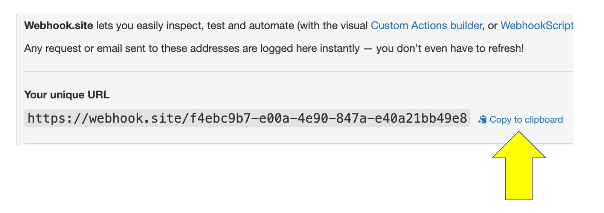
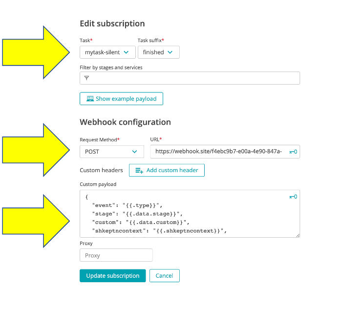
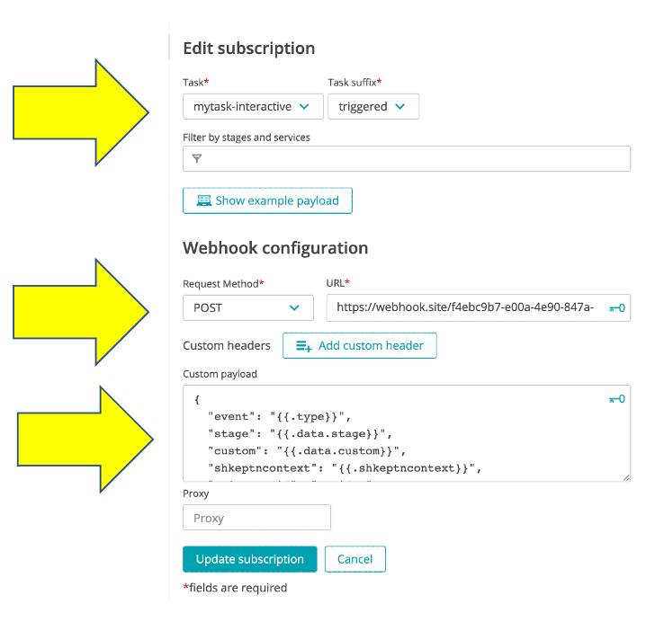
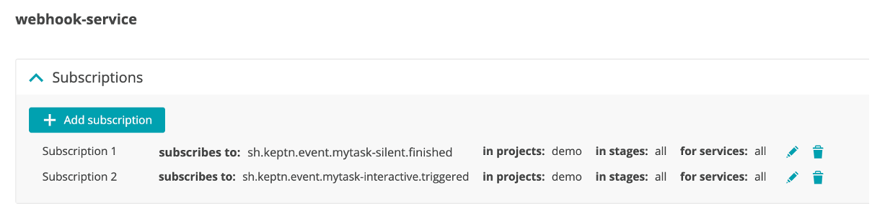

# Configure Cloud Automation Webhook subscriptions

Follow these steps to configure two webhooks.  The goal is to use these to demo both the [silent](https://www.dynatrace.com/support/help/how-to-use-dynatrace/cloud-automation/lifecycle-orchestration/#silent-mode-activation) and [interactive](https://www.dynatrace.com/support/help/how-to-use-dynatrace/cloud-automation/lifecycle-orchestration/#interactive-mode-activation) webhooks.

## Step 1: Get a webhook target

For a quick setup, you will direct the events to a web site what will capture http requests to it.  To get you unique webhook target, just open `https://webhook.site` page in a new browser tab and keep it open.

Copy the unique URL that is generated.



## Step 2: Configure the `silent` webhook

1. From the Cloud Automation UI, click on the project `demo`

1. On the left menu click on the `Uniform` option

1. Click on the `web-hook` service.

1. Click the `Add subscription` button

1. On the `New subscription` page, fill in the following values as shown below.
    * task = `mytask-silent`
    * Task suffix = `finished`
    * request method = `POST`
    * URL = the wehbook.site URL you copied
    * custom payload below
        ```
        {
            "event": "{{.type}}",
            "stage": "{{.data.stage}}",
            "custom": "{{.data.custom}}",
            "shkeptncontext": "{{.shkeptncontext}}",
            "triggeredid": "{{.id}}"
        }
        ```

    

1. Click the `Create subscription` button

## Step 3: Configure the `interactive` webhook

1. Click the `Add subscription` button

1. On the `New subscription` page, fill in the following values as shown below.
    * task = `mytask-interactive`
    * Task suffix = `triggered`
    * request method = `POST`
    * URL = the wehbook.site URL you copied
    * custom payload below
        ```
        {
            "event": "{{.type}}",
            "stage": "{{.data.stage}}",
            "custom": "{{.data.custom}}",
            "shkeptncontext": "{{.shkeptncontext}}",
            "triggeredid": "{{.id}}"
        }
        ```
    

1. Click the `Create subscription` button

## Step 4: Review

The webhooks should look like this



## Step 5: Adjust the `interactive` webhook configuration in GIT

A UI enhancement is coming, for for now you need to manually adjust the webhook.yaml for the interactive webhook.  

Open up the project in your git upstream repo and adjust the `webhook.yaml` file in the `master` branch to add the `sendFinished: false` row as shown below.

```
apiVersion: webhookconfig.keptn.sh/v1alpha1
kind: WebhookConfig
metadata:3
  name: webhook-configuration
spec:
  webhooks:
    - type: sh.keptn.event.mytask.triggered
      sendFinished: false    <-- ** ADD THIS ROW **
      requests:
        - curl --request POST --data
    ...
    ...
```

<hr>

[](ONBOARD.md) [](TRIGGER.md)