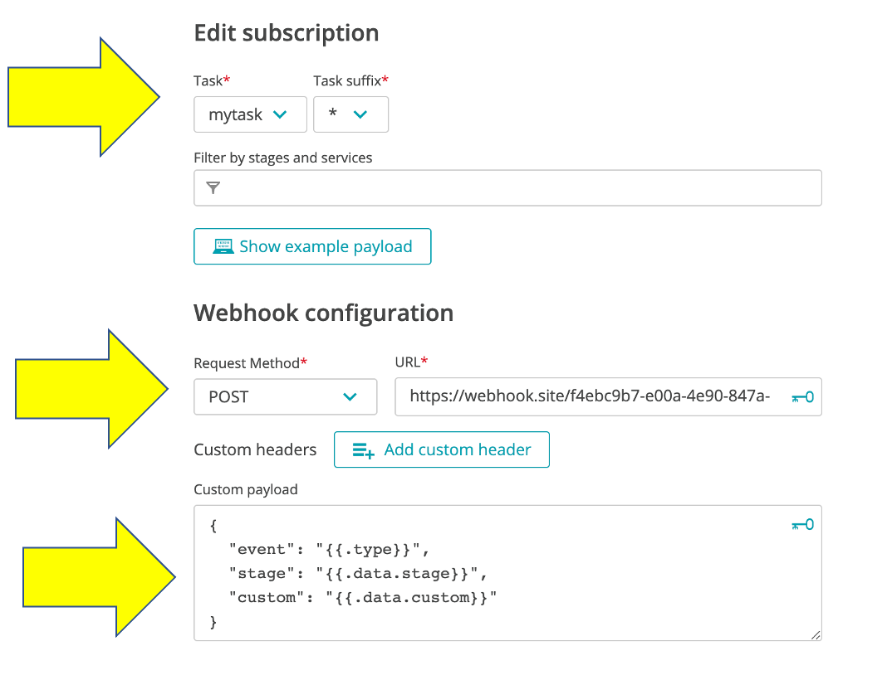

# Configure Cloud Automation Webhook subscription

Follow these steps to configure a webhook.  

## Step 1: Get a webhook target

For a quick setup, you will direct the events to a web site what will capture http requests to it.  To get you unique webhook target, just open `https://webhook.site` page in a new browser tab and keep it open.

Copy the unique URL that is generated.


## Step 2: Configure the webhook

1. From the Cloud Automation UI, click on the project `demo`

1. On the left menu click on the `Uniform` option

1. Click on the `web-hook` service.

1. Click the `Add subscription` button

1. On the `New subscription` page, fill in the following values as shown below.
    * task = `mytask`
    * Task suffix = `*`
    * request method = `POST`
    * URL = the wehbook.site URL you copied
    * custom payload below
        ```
        {
            "event": "{{.type}}",
            "stage": "{{.data.stage}}",
            "custom": "{{.data.custom}}"
        }
        ```

    

1. Click the `Create subscription` button

<hr>

[](ONBOARD.md) [](TRIGGER.md)