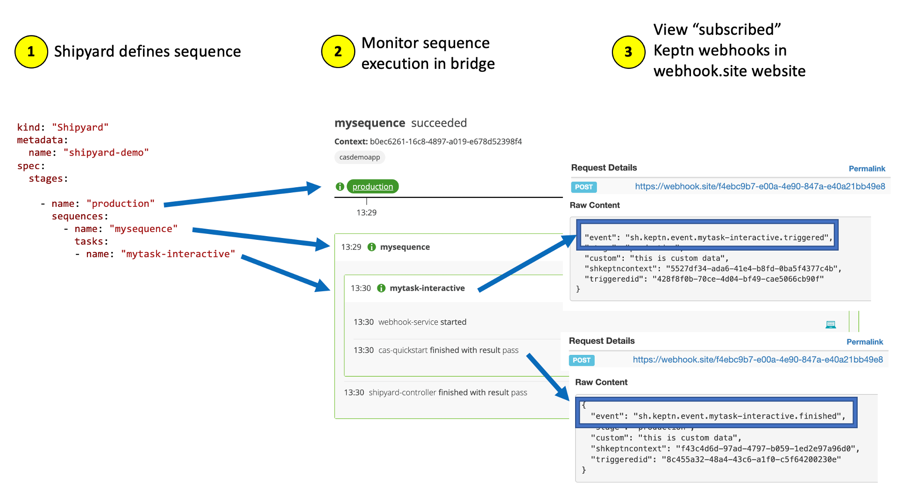

# Webhooks overview

Before you start, I encourage you to review these resources:

* [Cloud Automation Webhooks Overview blog](https://www.dynatrace.com/news/blog/dynatrace-enables-tool-agnostic-automation-for-your-application-lifecycle/)
* [Cloud Automation Webhooks for Slack video](https://www.youtube.com/watch?v=0vJS7ecayGw&t=267s)
* [Cloud Automation Webhooks for GitHub Actions video](https://www.youtube.com/watch?v=d32WHNmtqOs)

# Use Case Overview

There are two webhook types that you will setup and review for this guide.

## #1 Silent webhook

For this use case, you will start with the builtin task called `evaluation` that performs an automated SLO evaluation. Your webhook will subscribe to the `evaluation.finished` event as to get the results.

The picture below shows the silent webhook activation mode:

## #2 Interactive webhook

For this use case, you will simulate what a downstream system does by triggering a custom task and having that task send back with a `mytask-interactive.finished` event in order for the sequence to continue.  This custom task does nothing, but allows you to understand how to run the interactive model as to help you setup your custom integration.

The picture below shows the interactive webhook activation mode:

See [Dynatrace Docs](https://www.dynatrace.com/support/help/how-to-use-dynatrace/cloud-automation/lifecycle-orchestration) for additional details.

# Webhook.site

You will configure both types of webhooks to send the HTTP request and payload to this web site `https://webhook.site` This is a quick way to see the events that would be send to a downstream tool. 

To get you unique webhook URL, just open https://webhook.site in a new browser tab.  Keep this tab open while using this guide. You can use the copy to clipboard button to get your unique URL that you will configure later in the guide as part of the webhooks configuration.

 

Later in the guide once you setup the webhook subscriptions, you will trigger a sequence and view the webhook payloads in the https://webhook.site as shown below.

# Trigger a sequence script

A UI enhancement is coming, but for now you need to make an API call or use the Keptn CLI to trigger a sequence to run.  To make this task easier, the `scripts/trigger.sh` script in this repo will send in the various Cloud Automation events using the Keptn CLI and JSON event templates found in the `scripts/events/` subfolder.  You will run this script from the SSH shell when directed to as part of the use cases.

 