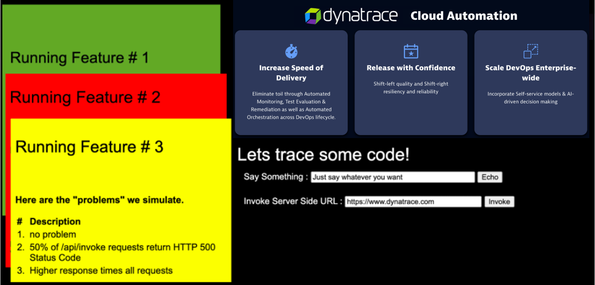

# Overview

This simple Node.JS app comes with built-in "feature" behaviors - meaning - if you launch the app and tell it to run as feature 1, 2, 3 to show slightly different behavior.  

| Feature | Behavior |
| ----- | --------- |
| 1 | Everything good |
| 2 | 50% Failure Rate of /api/invoke|
| 3 | Higher response times all requests|

As shown below, the web UI will change colors based on the enabled feature.



A feature is set using a Docker build argument that sets an environment variable the application code looks for. 

## Running the application

A `docker-compose.yaml` file can be used to start up both the `demoapp` and `demoappload` application.  The application will be exposed on port 80 and the `demoappload` application will continuously send requests to it.

1. Start up the application
    ```
    sudo docker-compose up
    ```
1. Start up the application
    ```
    sudo docker-compose down
    ```

# Development

1. You must have [node installed](https://nodejs.org/en/download/) locally.
1. Once you clone the repo, you need to run `npm install` to download the required modules.  I used npm: '8.5.0',
  node: '16.14.2'
  
    ```
    npm update
    npm start
    ```

    Access the application @ http://127.0.0.1:8080/

1. Build and run Docker image manually

    ```
    docker build --build-arg FEATURE_NUMBER=1 -t dt-demos/jfrog-demo-app:1.0.0 .
    docker run -it -p 8080:8080 dt-demos/jfrog-demo-app:1.0.0
    ```
    
    Access the application @ http://127.0.0.1:8080/